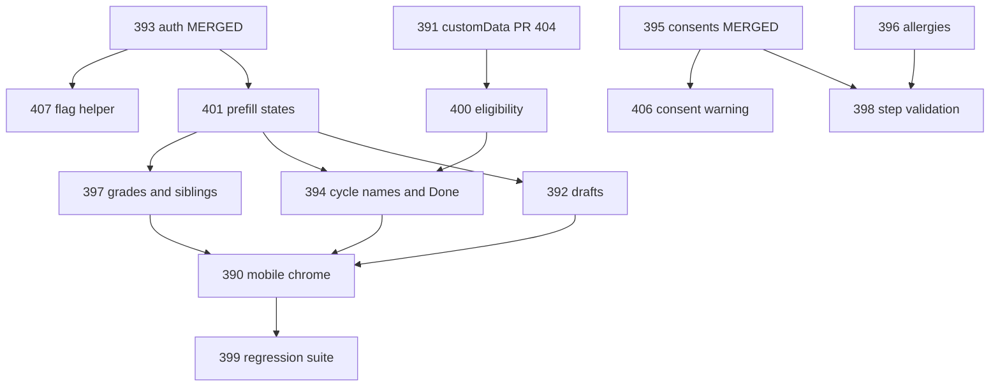

# Registration remediation campaign

Parent: [#389](https://github.com/tzlukoma/gather-kids/issues/389). Agents never merge or deploy. Each ticket is one worktree, one draft PR, then stop.

## Current baseline

Already on `origin/main`:

- [#395](https://github.com/tzlukoma/gather-kids/issues/395) consents — merged as [#403](https://github.com/tzlukoma/gather-kids/pull/403)
- [#393](https://github.com/tzlukoma/gather-kids/issues/393) auth/magic-link — merged as [#402](https://github.com/tzlukoma/gather-kids/pull/402)

Still open in Wave 1:

- [#391](https://github.com/tzlukoma/gather-kids/issues/391) custom-question persistence — draft [#404](https://github.com/tzlukoma/gather-kids/pull/404) in `.worktrees/okoye-391`

Wave 1 review leftovers (also children of #389; include them so they do not drift):

- [#406](https://github.com/tzlukoma/gather-kids/issues/406) choir consent fail-open warning
- [#407](https://github.com/tzlukoma/gather-kids/issues/407) shared server flag-eval helper

The original #395/#391 “schema overlap” is Zod/form shape, not a Postgres migration. #391 is the remaining form-schema owner (`customFields` → `customData` in [registration-schema.ts](src/components/gatherKids/registration-wizard/registration-schema.ts)). Later tickets that also edit that file (#396, #398, #397) rebase after #404 lands.

## Operating rules

- Follow [implement-ticket](.agents/skills/implement-ticket/SKILL.md), [git-worktree](.agents/skills/git-worktree/SKILL.md), [verify-change](.agents/skills/verify-change/SKILL.md), and [pr-evidence](.agents/skills/pr-evidence/SKILL.md).
- Work only in `.worktrees/<slug>` (or a Cursor-created isolated worktree). Do not implement on the primary checkout.
- One issue per PR. No opportunistic refactors. Escalate if handwritten diff will exceed ~500 lines.
- First-batch bases: every new PR in this sitting branches from `origin/main` (plus finishing existing #404). Do not stack Wave 3, #398, or #400 on unmerged drafts.
- After each implementation, launch a **separate** review subagent (not the implementer) against that worktree/diff. Fix findings, then open or update the **draft** PR. Do not mark ready-for-review as if merge were authorised; apply `agent:review-ready` and move the **issue** to **PR Review**.
- Flag stays server-only and default-off. Synthetic data only. No UAT/production mutation.

## What you will review when you return

Yes — you can leave after approving execution, and come back to a **batch of draft PRs** in [Ready to Review](https://github.com/users/tzlukoma/projects/7/views/6). You will not come back to the entire #389 campaign finished.

This sitting stops after the first independent batch is handed off. Agents cannot merge, so later waves stay blocked until you squash-merge.

Expected first batch (all intended to be reviewable independently off `main`):

- [#404](https://github.com/tzlukoma/gather-kids/pull/404) / #391 custom-question persistence (already open; polish + peer review)
- #406 choir consent misconfiguration warning
- #407 shared flag-eval helper
- #396 allergies
- #401 prefill / overwrite states
- #399 fixture builders only (no final scenario matrix)

Held until after you merge that batch:

- #400 (needs #391 / `customData` on main)
- #398 (needs #396 allergy rules on main)
- Wave 3 #397 → #394 → #392
- #390 mobile chrome
- #399 final scenarios

Recommended merge order when you return: **#406, #407** (tiny) → **#391** → **#396** and **#401** (parallel) → **#399 fixtures** if it does not conflict. Then tell me to start the next sitting.

## File ownership (collision map)

Use this to decide what can run in parallel. If two open worktrees need the same file, the later ticket stacks or waits.

- [registration-schema.ts](src/components/gatherKids/registration-wizard/registration-schema.ts): #391 (in flight) then #396 then #398/#397
- [step4-ministries.tsx](src/components/gatherKids/registration-wizard/steps/step4-ministries.tsx): #391 then #400 then #397
- [step3-children.tsx](src/components/gatherKids/registration-wizard/steps/step3-children.tsx): #396 then #397
- [step5-consents.tsx](src/components/gatherKids/registration-wizard/steps/step5-consents.tsx) / [consent-context.ts](src/components/gatherKids/registration-wizard/consent-context.ts): #406 only
- [registration-entry.tsx](src/components/gatherKids/registration-wizard/registration-entry.tsx): #401 then Wave 3 in merge order #397 → #394 → #392
- [index.tsx](src/components/gatherKids/registration-wizard/index.tsx): #398 (validation), #400 (Done summary source), then Wave 3
- [registration-done.tsx](src/components/gatherKids/registration-wizard/registration-done.tsx): #400 then #394
- [src/app/register/page.tsx](src/app/register/page.tsx) + new `src/lib/flags/` helper: #407
- Layout/chrome ([register/layout.tsx](src/app/register/layout.tsx), sticky actions in `index.tsx`): #390 last

## Per-ticket loop

1. `git fetch origin main` and `gh issue view <n>`. Stop if already shipped or stale.
2. Prune merged worktrees. Create `.worktrees/okoye-<n>` from the base in the wave table.
3. Set `agent:managed`, Agent=Cursor, status **Agent Working**.
4. Implement only that issue. Share one eligibility/prefill/validation helper rather than forking business rules.
5. Run the [verify-change](.agents/skills/verify-change/SKILL.md) gate for that change type (registration PRs also run the three contract tests). UI PRs need a mobile-width check and synthetic screenshots.
6. Launch a peer-review subagent on that worktree. Address findings.
7. Draft PR with the evidence checklist. Request `@tzlukoma`. Move the issue to **PR Review**. Stop.
8. When you merge: rebase stacked dependents onto `origin/main`, then `git worktree remove` the merged tree.

## Wave execution

### Wave 1 leftover — finish now

**#391** — stay in `.worktrees/okoye-391` / `fix/okoye-391-custom-data`. Peer-review PR 404, complete the unfinished local/CI evidence (Jest was skipped for an SWC binding issue), keep `customData` as the single DAL path. Do not expand into eligibility or allergies.

### Wave 2 — this sitting, parallel off `main`

Launch these as separate worktrees/subagents once execution is approved. All branch from `origin/main`. Stop after their draft PRs are in **PR Review**.

- **#406** — `consent-context.ts`, Step 5. Sentry warning once per session; no PII.
- **#407** — `src/lib/flags/` helper; register + check-in pages. Behavior-neutral extract.
- **#396** — schema + `step3-children.tsx`. Explicit none vs details; no allergy logs/analytics.
- **#401** — `registration-entry.tsx`, Step 1, household load mapping. Three states: empty / prior-cycle / current-cycle overwrite.
- **#399 infra only** — shared synthetic builders. No final scenario matrix.

Do **not** start #400 or #398 in this sitting. #400 needs #391 on main. #398 needs #396 allergy rules on main. Starting them stacked would make the return batch order-sensitive.

### Later sittings (after you merge the first batch)

**#400** then **#398**, each from updated `origin/main`.

**Wave 3** — implement in parallel worktrees, merge one at a time **#397 → #394 → #392**.

- **#397** after #401. Canonical grade values; sibling Review/resume on Step 4.
- **#394** after #400 and #401. Cycle **name** not `cycle_id`; Bible Bee link only if persisted.
- **#392** after #401. Honor the draft toggle for read/write/status; Cancel and successful submit clear the draft.

**#390** only after Wave 3 lands. **#399** final scenarios only after #390.

## What I will not do

- Flip `gathersystem_registration` in production PostHog
- Mark parent #389 **Done**
- Mix schema + auth + layout into one PR
- Start #390 before functional screens stabilize

