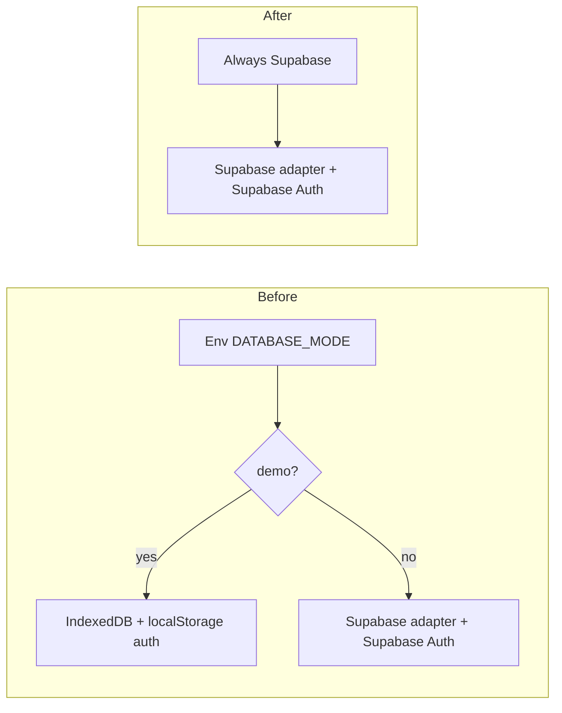

# Remove Demo Mode Refactor

## Current state

- **Two modes**: `DATABASE_MODE` = `"demo"` (IndexedDB + localStorage auth + hardcoded demo users) or `"supabase"` (Supabase DB + Supabase Auth).
- **Feature flag**: `NEXT_PUBLIC_SHOW_DEMO_FEATURES` gates the "Show Demo Features" UI (seed button, feature-flag dialog) and interacts with `DATABASE_MODE`.
- **Two `isDemo` sources**: [src/lib/featureFlags.ts](src/lib/featureFlags.ts) (used by DAL, feature-flag context, some API routes) and [src/lib/authGuards.ts](src/lib/authGuards.ts) (used by auth context, login, protected routes, etc.). They can disagree when `SHOW_DEMO_FEATURES` is false but `DATABASE_MODE` is demo.
- **DAL**: [src/lib/dal.ts](src/lib/dal.ts) has ~144 references to demo/legacy Dexie; when not in demo it uses `dbAdapter` from [src/lib/database/factory.ts](src/lib/database/factory.ts). Demo path uses direct Dexie `db`.
- **Auth**: In demo, [src/contexts/auth-context.tsx](src/contexts/auth-context.tsx) uses localStorage for user; [src/app/login/page.tsx](src/app/login/page.tsx) uses `DEMO_USERS` and quick-fill buttons and skips Supabase sign-in.
- **Vercel preview**: Auth also falls back to localStorage when `window.location.hostname.includes('vercel.app')`. That is independent of demo mode; you can keep or remove it (recommend keeping for preview deployments unless UAT replaces all preview usage).

## Architecture after refactor

- **Single code path**: Supabase only. No `DATABASE_MODE` or `SHOW_DEMO_FEATURES`; no `isDemo()`.
- **Database**: [src/lib/database/factory.ts](src/lib/database/factory.ts) always returns `SupabaseAdapter` (require Supabase env in all non-test environments; tests keep mocks).
- **Auth**: Always Supabase Auth; remove demo localStorage auth and `DEMO_USERS` on login.
- **UAT**: Configure UAT env with Supabase (and optional seed). Use UAT for demos; no in-app "demo mode."

## Implementation plan

### 1. Feature flags and env

- **[src/lib/featureFlags.ts](src/lib/featureFlags.ts)**  
  - Remove flag names `DATABASE_MODE` and `SHOW_DEMO_FEATURES` from the type and `getFlag` switch.  
  - Remove `isDemo()` (and its `console.log`).  
  - Leave other flags (e.g. `LOGIN_MAGIC_ENABLED`, `REGISTRATION_DRAFT_PERSISTENCE_ENABLED`) unchanged.
- **[src/lib/authGuards.ts](src/lib/authGuards.ts)**  
  - Remove `isDemo()`. Keep `isMagicLinkEnabled` and `isPasswordEnabled` (and any other non-demo helpers).
- **[src/contexts/feature-flag-context.tsx](src/contexts/feature-flag-context.tsx)**  
  - Remove `isDemoMode` and `showDemoFeatures` from the context type and state.  
  - Remove `SHOW_DEMO_FEATURES` and localStorage logic for "Show Demo Features".  
  - Remove `isDemo` import and any logic that depends on it.
- **Env and docs**  
  - [.env.e2e.local.example](.env.e2e.local.example): Remove `NEXT_PUBLIC_DATABASE_MODE` and `NEXT_PUBLIC_SHOW_DEMO_FEATURES`; document Supabase (local or UAT) for e2e.  
  - If other `.env`* examples reference these vars, remove or update them.

### 2. Database layer

- **[src/lib/database/factory.ts](src/lib/database/factory.ts)**  
  - Always use `getFlag('DATABASE_MODE')` in the same way as today: since we are removing the flag, change logic to "always Supabase": read `NEXT_PUBLIC_SUPABASE_URL` and `NEXT_PUBLIC_SUPABASE_ANON_KEY`; if missing (and not in test), log error and optionally throw or keep a single fallback for local dev.  
  - Remove the `mode === 'demo'` branch that returns `IndexedDBAdapter`.  
  - No more fallback to IndexedDB for "demo mode."
- **[src/lib/dal.ts](src/lib/dal.ts)**  
  - Remove `isDemo` import and `shouldUseAdapter()`.  
  - Use the adapter (e.g. `dbAdapter`) for all reads/writes; remove every branch that uses the legacy Dexie `db` for "demo mode" (search for "demo mode", "Use legacy Dexie", `isDemoMode`, `shouldUseAdapter`).  
  - This will touch a large number of call sites; do in a focused pass and run DAL/dashboard tests after.
- **[src/lib/database/canonical-dal.ts](src/lib/database/canonical-dal.ts)**  
  - Remove `isDemo()` check (e.g. the `if (!isDemo())` guard) and keep the Supabase path only.
- **IndexedDB adapter**  
  - [src/lib/database/indexed-db-adapter.ts](src/lib/database/indexed-db-adapter.ts) can remain in the repo for now (e.g. future offline or local dev) but will no longer be used by the factory in production/uat paths. Optional follow-up: restrict its use to tests or a separate local-only entrypoint.

### 3. Auth flow

- **[src/contexts/auth-context.tsx](src/contexts/auth-context.tsx)**  
  - Remove `isDemo()` and all branches that use localStorage when `isDemo()` is true.  
  - Keep `isVercelPreview` and localStorage fallback only for Vercel preview if you want preview deployments to work without Supabase; otherwise remove that too and rely on Supabase everywhere.
- **[src/app/login/page.tsx](src/app/login/page.tsx)**  
  - Remove `DEMO_USERS` and all demo quick-fill buttons and "demo mode" messaging.  
  - Use Supabase sign-in only; keep existing password/magic/Google flows that already use Supabase.
- **[src/components/auth/protected-route.tsx](src/components/auth/protected-route.tsx)**  
  - Remove `isDemo()` and the "demo user in localStorage" reload logic; rely on auth context + Supabase session only.
- **[src/app/create-account/page.tsx](src/app/create-account/page.tsx)**  
  - Remove redirect that depends on `flags.isDemoMode`; use only e.g. `flags.loginPasswordEnabled` (or equivalent) if needed.
- **[src/app/onboarding/page.tsx](src/app/onboarding/page.tsx)**  
  - Remove `isDemo()` redirect and demo notice.
- **[src/app/settings/security/page.tsx](src/app/settings/security/page.tsx)**  
  - Remove `isDemo()` redirect and demo notice.
- **[src/app/auth/reset-password/page.tsx](src/app/auth/reset-password/page.tsx)**  
  - Remove `isDemoMode` and demo-only bypass/messaging; use normal Supabase reset flow.
- **[src/app/auth/callback/page.tsx](src/app/auth/callback/page.tsx)**  
  - Remove `isDemo()` early-return; always handle Supabase callback.
- **[src/components/gatherKids/dashboard-nav.tsx](src/components/gatherKids/dashboard-nav.tsx)**  
  - Always call Supabase logout (remove `if (!isDemo())`).
- **[src/components/auth/forgot-password-dialog.tsx](src/components/auth/forgot-password-dialog.tsx)**  
  - Remove demo-only messaging and branches (`isDemoMode`).
- **[src/components/settings/settings-modal.tsx](src/components/settings/settings-modal.tsx)**  
  - Remove all `isDemo()` branches (e.g. demo image handling, demo email update, demo password message).
- **[src/app/household/profile/page.tsx](src/app/household/profile/page.tsx)**  
  - Remove `isDemoMode` and demo-only UI.
- **[src/app/household/page.tsx](src/app/household/page.tsx)**  
  - Remove demo-specific onboarding check for `user_parent_demo`.
- **[src/app/register/page.tsx](src/app/register/page.tsx)**  
  - Remove `isDemoMode` and any "demo mode skip email verification" or demo-only logic; rely on Supabase + env flags (e.g. magic link) only.

### 4. API routes and other libs

- **[src/app/api/me/photo/route.ts](src/app/api/me/photo/route.ts)** and **[src/app/api/children/[childId]/photo/route.ts](src/app/api/children/[childId]/photo/route.ts)**  
  - Remove `isDemo()` branches; always use Supabase storage (or your normal upload path).
- **[src/lib/auth-utils.ts](src/lib/auth-utils.ts)**  
  - Remove or reword comments that say "demo system" / "demo mode"; keep behavior that works for single-role or metadata-based role.
- **[src/hooks/useDraftPersistence.ts](src/hooks/useDraftPersistence.ts)**  
  - Remove `isDemo()` check; keep behavior aligned with Supabase (or Vercel preview if you keep it).
- **[src/lib/bibleBee.ts](src/lib/bibleBee.ts)** and **[src/hooks/data/bibleBee.ts](src/hooks/data/bibleBee.ts)**  
  - Remove "demo mode" / "legacy Dexie" branches; use the same data layer as the rest of the app (adapter/Supabase).
- **[src/components/gatherKids/onboarding-modal.tsx](src/components/gatherKids/onboarding-modal.tsx)**  
  - Remove demo-only localStorage dismissal; use normal flow (e.g. Supabase or server).

### 5. UI: home page and feature-flag dialog

- **[src/app/page.tsx](src/app/page.tsx)**  
  - Remove `process.env.NEXT_PUBLIC_DATABASE_MODE !== 'supabase'` checks (e.g. "Go to Admin Dashboard" and loading skeleton).  
  - Remove `flags.showDemoFeatures` and the SimpleSeedButton + FeatureFlagDialog.  
  - If you want a "seed data" button on UAT only, introduce a separate env (e.g. `NEXT_PUBLIC_ALLOW_SEED=true`) and gate SimpleSeedButton on that; otherwise remove it.
- **[src/components/feature-flag-dialog.tsx](src/components/feature-flag-dialog.tsx)**  
  - Remove the "Show Demo Features" toggle and any `NEXT_PUBLIC_SHOW_DEMO_FEATURES` references. Either remove the dialog or repurpose it for other toggles (e.g. UAT-only flags).
- **[src/components/AuthDebug.tsx](src/components/AuthDebug.tsx)** and **[src/components/auth/auth-debug.tsx](src/components/auth/auth-debug.tsx)**  
  - Remove demo mode display and `isDemo` / `isDemoMode` references; show only "Live" / Supabase auth state.
- **[src/middleware.ts](src/middleware.ts)**  
  - Update comment: remove "demo mode"; clarify that middleware is skipped when Supabase config is missing (e.g. local dev or misconfiguration).

### 6. Tests

**Principle: preserve coverage.** When removing or changing tests that relied on demo mode, ensure the same functionality is still tested via the Supabase/live path. For each affected test file: (1) remove demo-only tests and env; (2) either rewrite those tests to use Supabase (or adapter) mocks and assert the same behavior, or confirm that existing "live" tests already cover that behavior; (3) add new tests if a scenario would otherwise be untested.

- **Jest**  
  - [jest.setup.ts](jest.setup.ts): Remove `isDemo: () => true` from the authGuards mock; use `isDemo: () => false` or remove the mock if `isDemo` is deleted.  
  - [src/test-utils/auth/mock-auth-guards.ts](src/test-utils/auth/mock-auth-guards.ts): Change `isDemo` to `() => false` or remove it if the symbol is removed from authGuards.
- **Feature flags**  
  - **[tests**/lib/feature-flags.test.ts](__tests__/lib/feature-flags.test.ts): Remove tests for `SHOW_DEMO_FEATURES` and `DATABASE_MODE` and `isDemo`. Add or keep tests for remaining flags so flag behavior is still covered.
  - **[tests**/auth/create-account-page.test.tsx](__tests__/auth/create-account-page.test.tsx): Remove demo-mode tests and env; rewrite or add tests so create-account redirect and "live" behavior (e.g. when password/magic are enabled) are still asserted.
- **Database**  
  - **[tests**/lib/database-adapter-factory.test.ts](__tests__/lib/database-adapter-factory.test.ts): Remove "demo" / IndexedDB expectations; keep or add tests that the factory returns Supabase adapter when Supabase env is set, and document expected behavior when env is missing (e.g. in tests).
  - **[tests**/lib/dal-dashboard-functions.test.ts](__tests__/lib/dal-dashboard-functions.test.ts): Remove `TEST_DATABASE_MODE` and demo-only setup; keep testing the same DAL behavior via adapter mocks (or Supabase test harness) so dashboard functions are still covered.
- **Auth / reset password**  
  - **[tests**/auth/reset-password.test.tsx](__tests__/auth/reset-password.test.tsx): Remove demo-only tests; rewrite so reset-password flow (form, token handling, success/error) is tested using Supabase auth mocks so the functionality remains covered.
- **Contracts / other**  
  - **[tests**/lib/avatar-storage.test.ts](__tests__/lib/avatar-storage.test.ts): Change "demo mode" expectations to the adapter/Supabase path; keep assertions for avatar update behavior so coverage is preserved.
  - **[tests**/contracts/casing.guard.test.ts](__tests__/contracts/casing.guard.test.ts) and **[tests**/contracts/registration.contract.test.ts](__tests__/contracts/registration.contract.test.ts): Set `isDemo` mock to `false` or remove; ensure contract tests still run against the canonical/Supabase path and that behavior is unchanged.
  - **[tests**/lib/bible-bee-ministry.test.ts](__tests__/lib/bible-bee-ministry.test.ts): Update mock so `isDemo` is `false` or omitted; keep ministry/Bible Bee behavior under test.
- **Coverage check**  
  - After test changes, run the full test suite and confirm no scenarios are dropped: any test that was removed because it was "demo only" should have a corresponding test (rewritten or existing) that covers the same user-facing or contract behavior via the Supabase path.

### 7. Scripts and E2E

- **scripts/debug**  
  - [scripts/debug/check-database-mode.js](scripts/debug/check-database-mode.js), [scripts/debug/check-auth-config.js](scripts/debug/check-auth-config.js), [scripts/debug/validate-db-config.js](scripts/debug/validate-db-config.js), [scripts/debug/test-database-adapter.js](scripts/debug/test-database-adapter.js): Remove references to `NEXT_PUBLIC_DATABASE_MODE` and `NEXT_PUBLIC_SHOW_DEMO_FEATURES`; document Supabase-only config.
- **E2E**  
  - [e2e/auth-registration.spec.ts](e2e/auth-registration.spec.ts): Remove "demo mode" fallbacks and any "use demo accounts" logic; rely on Supabase (local or UAT) and seeded test users. Rewrite or add scenarios so registration and auth flows exercised today (including via demo) are still covered with Supabase + test data.
  - [tests/playwright/admin-user-management.spec.ts](tests/playwright/admin-user-management.spec.ts): Ensure login uses Supabase (or documented test accounts on UAT); remove demo-only assumptions. Keep coverage for admin user management flows.
  - Update [tests/playwright/EMAIL_TESTING_GUIDE.md](tests/playwright/EMAIL_TESTING_GUIDE.md) to drop `isDemoMode` and describe UAT/local Supabase auth.

### 8. Seed and types

- **[src/lib/seed.ts](src/lib/seed.ts)**  
  - Keep seed data (e.g. demo ministry accounts, demo parent) for UAT/local seeding; only remove any logic that is gated by "running in demo mode" at runtime.
- **[src/lib/types.ts](src/lib/types.ts)**  
  - Update comments that mention "demo" (e.g. logo_url "for demo") to "local" or "development" if still accurate.

## Order of work

1. **Feature flags and guards** (remove `isDemo`, `DATABASE_MODE`, `SHOW_DEMO_FEATURES`) so the rest of the codebase can be updated against a single source of truth.
2. **Database factory and DAL** so all data goes through the Supabase adapter.
3. **Auth context and login** so auth is Supabase-only (and optionally Vercel preview).
4. **Protected routes, account/onboarding/security/reset-password pages, and auth callback** to remove demo branches.
5. **Remaining app and API routes** (photo routes, settings, register, household, bibleBee, useDraftPersistence).
6. **UI** (home, feature-flag dialog, auth debug).
7. **Tests** (Jest mocks, feature-flags, create-account, database factory, DAL, reset-password, contracts, avatar, bible-bee).
8. **Scripts and E2E** (debug scripts, auth-registration, admin-user-management, docs).

## Risks and notes

- **DAL size**: [src/lib/dal.ts](src/lib/dal.ts) has many demo/legacy branches; changes should be done in one or a few focused passes with tests after each.  
- **E2E**: E2E today may depend on demo mode for login; switching to Supabase (local or UAT) requires working Supabase config and seeded users.  
- **Vercel preview**: Deciding to keep or remove the `isVercelPreview` localStorage fallback affects auth-context and any tests that rely on preview behavior.

