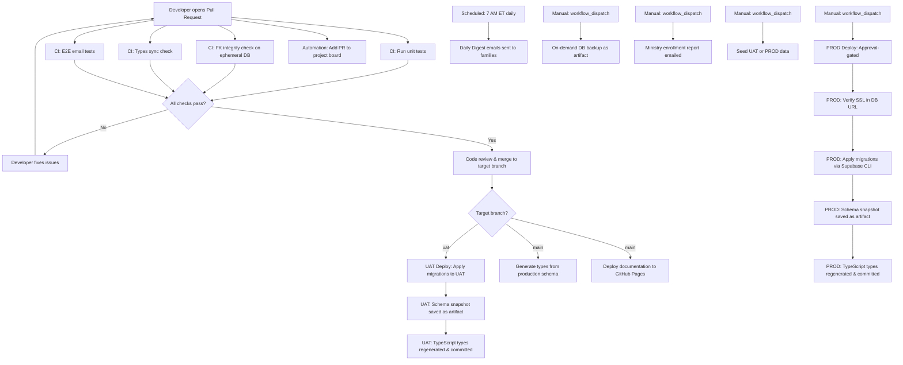

# CI/CD Pipeline Documentation

This document describes the complete continuous integration and deployment pipeline for the gatherKids repository as it is currently implemented. It is intended to give any contributor — regardless of experience with this codebase — a full understanding of how code moves from a developer's machine to production.

---

## Overview

The pipeline is built on GitHub Actions and follows a promotion model: changes are validated in CI, then promoted through UAT, and finally deployed to production through a manual, approval-gated workflow. The application layer (Next.js frontend) is deployed automatically by Vercel, while the database layer (Supabase) is managed through workflow-driven migrations. A set of supporting workflows handle scheduled reporting, on-demand backups, documentation publishing, and project management automation.

The philosophy of the pipeline is to catch problems as early as possible. Unit tests and database integrity checks run on every pull request before any code is merged. The UAT environment serves as a live integration environment where database migrations are validated before production promotion. Production deployments require a manual workflow dispatch, providing a deliberate gate before any change reaches real users.

---

## Pipeline Diagram

The following diagram illustrates the end-to-end flow from a developer commit to a production deployment.

---

## Workflow Files

The following sections document every workflow file in `.github/workflows/`, explaining what each does, when it runs, and what it requires.

---

### ci.yml — Unit Test Suite

This workflow is the primary code quality gate. It runs automatically on every pull request event — when a PR is opened, updated, or reopened — and its purpose is to ensure that no new code breaks the existing test suite.

The workflow checks out the repository, installs Node.js version 18 with npm caching enabled, installs all dependencies, and then runs the full Jest test suite in silent mode (suppressing verbose output for cleaner CI logs). It has read-only access to repository contents and does not interact with any external services or secrets.

If any test fails, the workflow fails and the pull request is blocked from merging (assuming branch protection rules are configured). No secrets or environment variables are required beyond the standard Node environment.

---

### ci-db-fk-check.yml — Database Migration and Foreign Key Integrity

This workflow validates that all SQL migrations in the repository can be applied cleanly and that they do not introduce foreign key constraint violations. It runs on every pull request and on every push to the main branch.

The workflow spins up a temporary PostgreSQL 15 service container on port 54322, waits for it to become healthy, configures the necessary PostgreSQL environment variables for the session, applies every migration file from the `supabase/migrations/` directory in order, and then runs the `scripts/db/check_fks.sh` script to verify foreign key integrity. The entire database is ephemeral — it exists only for the duration of the workflow run and is discarded afterward.

This check ensures that migrations are always in a valid, orderly state before they reach any real environment. No external secrets are required because everything runs locally within the runner.

---

### uat-migration-dryrun.yml — UAT Migration Dry Run

This workflow runs whenever a pull request is opened or updated against the `uat` branch and the changes include files in `supabase/migrations/` or `scripts/db/`. It performs a read-only pre-flight check by comparing the repository's migration files against what has already been applied to the UAT database, and reports which migrations would be applied if the PR were merged.

The workflow installs the PostgreSQL client, makes the `list_unapplied_migrations.sh` script executable, and calls it with the UAT database URL and migrations directory. The result tells reviewers exactly what schema changes will be promoted to UAT when the PR is merged.

This workflow requires the `UAT_DATABASE_URL` secret to be available in the `uat` environment.

---

### uat-deploy.yml — UAT Database Deployment

This workflow is responsible for deploying database migrations to the UAT environment. It triggers automatically when code is pushed to the `uat` branch and the push includes changes to migration files or database scripts. It runs within the `uat` GitHub environment, which means it has access to UAT-scoped secrets and can be subject to any environment protection rules configured in GitHub.

The workflow proceeds through several stages. First, it verifies that the UAT database URL includes `sslmode=require` to enforce encrypted connections. Next, it applies all pending migrations using the `apply_migrations_cli.sh` script via the Supabase CLI. After a successful migration, it downloads and runs the Supabase CLI to create a full schema snapshot, which is uploaded as a GitHub Actions artifact with a 14-day retention period. This snapshot provides a point-in-time record of the UAT schema after each deployment.

Following the schema snapshot, the workflow installs Node.js and project dependencies, installs the Supabase CLI again, extracts the project ID from the UAT Supabase URL, links the Supabase project, and runs the `scripts/gen-types.cjs` script to regenerate the TypeScript type definitions from the live UAT schema. If the regenerated types file differs from what is currently committed, the workflow commits and pushes the updated file directly to the `uat` branch with an automated commit message.

This workflow requires the following secrets: `UAT_DATABASE_URL`, `UAT_SUPABASE_URL`, `SUPABASE_ACCESS_TOKEN`, and `SUPABASE_DB_PASSWORD`.

---

### uat-db-check.yml — Manual UAT Database Integrity Check

This workflow can be triggered manually at any time through the GitHub Actions interface. It provides an on-demand way to verify the health of the UAT database without making any changes. The workflow installs the PostgreSQL client, runs all migrations through the `apply_migrations_safe.sh` script, and then runs the FK integrity check script against the UAT database.

This is useful for troubleshooting or for confirming database health before or after manual interventions. It requires the `UAT_DATABASE_URL` secret.

---

### prod-deploy.yml — Production Database Deployment

This is the highest-stakes workflow in the repository. It can only be triggered manually via a workflow dispatch event, and it runs within the `production` GitHub environment, which should be configured in GitHub with required reviewers to enforce human approval before any production deployment proceeds.

The workflow begins with a safety validation confirming that the production database URL includes `sslmode=require`. It then downloads and installs the Supabase CLI, extracts the production project ID from the Supabase URL, and links the project. Before applying migrations, it runs the `ensure_pgcrypto.sh` script to safely confirm that the pgcrypto extension is available — this step continues even if the extension already exists or insufficient privileges prevent its creation.

Migration application happens in two passes. First, `supabase db push --include-all` is used to apply any migrations not yet reflected in the remote schema. If this step fails (which can happen when migrations conflict with an already-partially-applied state), the workflow logs the error and continues rather than aborting. Second, the `safe_apply_migrations.sh` script is run to handle any remaining migrations in a more fault-tolerant manner. Finally, the `safe_table_setup.sh` script ensures that all required tables exist.

After migrations are applied, the workflow creates a full production schema snapshot (uploaded as an artifact with 30-day retention), installs Node.js, regenerates TypeScript types from the production schema, and commits any changes back to the branch.

This workflow requires the following secrets: `PROD_DATABASE_URL`, `PROD_SUPABASE_URL`, `SUPABASE_ACCESS_TOKEN`, and `SUPABASE_DB_PASSWORD`.

---

### db-backup.yml — On-Demand Database Backup

This workflow creates a complete logical backup of either the UAT or PROD database and uploads it as a GitHub Actions artifact. It is triggered manually via workflow dispatch. When triggering the workflow, the operator selects the target environment and optionally provides a label that will be appended to the backup filename (for example, "pre-release").

The backup process installs the Supabase CLI, selects the appropriate environment configuration based on the input, creates a dump directory, and then runs three separate dump operations: a roles-only dump, a full schema dump, and a data-only dump. All three files are bundled together into a single compressed archive. The archive is then uploaded as a GitHub Actions artifact with a 30-day retention period.

The workflow also contains optional GPG encryption logic (currently commented out in the workflow source) that can be re-enabled by uncommenting the relevant steps. When active, it imports a GPG public key from a repository secret and encrypts the archive before uploading. Similarly, there is commented-out logic for uploading the backup to Google Drive using rclone, which can be re-enabled with appropriate service account credentials.

This workflow requires the following secrets: `SUPABASE_ACCESS_TOKEN`, `SUPABASE_DB_PASSWORD`, and either `UAT_DATABASE_URL` / `UAT_SUPABASE_URL` or `PROD_DATABASE_URL` / `PROD_SUPABASE_URL` depending on the selected environment. Optional secrets for Google Drive integration include `GDRIVE_SA_JSON`, `GDRIVE_FOLDER_ID_PROD`, `GDRIVE_FOLDER_ID_UAT`, `GPG_PUBLIC_KEY`, and `GPG_RECIPIENT`.

---

### ensure-pgcrypto.yml — Reusable pgcrypto Extension Check

This is a reusable workflow (triggered via `workflow_call`) that other workflows can invoke to ensure the pgcrypto PostgreSQL extension is available in a target database. It installs the PostgreSQL client, generates a safe idempotent SQL script that checks for the extension's existence before attempting to create it, and executes it against the provided database URL. The script handles permission errors gracefully and always exits successfully, since many managed Supabase instances have the extension pre-installed at a system level where the application user cannot directly manage it.

It accepts the target environment name as an input and requires a `DATABASE_URL` secret to be passed from the calling workflow.

---

### setup-tables-on-demand.yml — On-Demand Table Setup

This workflow is a manual utility for creating or verifying database tables in any supported environment (production, UAT, or staging). It is triggered via workflow dispatch and accepts inputs for the target environment, the method to use for table creation, and whether to perform a dry run (verify only, no changes).

The available methods are: running the complete table setup script, executing direct SQL, creating only missing tables, or performing a manual check. In dry-run mode, the workflow confirms what would be done without making any changes. This is intended as an operational tool for initial setup or recovery scenarios, not for routine deployments.

It requires `SUPABASE_ACCESS_TOKEN`, `SUPABASE_DB_PASSWORD`, and the appropriate Supabase URL secret for the selected environment.

---

### generate-types.yml — TypeScript Type Generation on Migration Change

This workflow regenerates the TypeScript type definitions for the Supabase database schema whenever migration files change on the main branch. It runs on pushes to main (when `supabase/migrations/` files change), on pull requests touching migrations, and can be triggered manually.

The workflow validates that the required secrets are present, installs Node.js and project dependencies, downloads the Supabase CLI, and then (for pushes to main only) extracts the production project ID, links the project, and runs the `scripts/gen-types.cjs` script to generate updated types. The resulting `src/lib/database/supabase-types.ts` file is committed and pushed if it differs from the current version.

On pull requests, the workflow validates secrets and installs dependencies but skips the actual type generation step (which requires a production database connection). This is primarily a check to confirm the workflow can proceed.

This workflow requires the `production` environment secrets: `SUPABASE_ACCESS_TOKEN`, `PROD_SUPABASE_URL`, and `SUPABASE_DB_PASSWORD`.

---

### gen-supabase-types.yml — CI Type Generation Utility

This is an alternative, manually-triggered type generation workflow intended for use in CI or developer-initiated type refresh scenarios. It installs a pinned version of the Supabase CLI (version 1.52.2, chosen for known compatibility) rather than the latest release, attempts to generate types locally, and falls back to remote generation if local generation is not possible.

If triggered with the `commit` input set to true, the workflow creates a new branch, commits the updated types file, and opens a pull request targeting the `develop` branch. This allows type updates to go through the normal review process rather than being pushed directly.

The generated types file is also uploaded as a GitHub Actions artifact named "supabase-types". No secrets are required for local generation; remote generation requires `SUPABASE_ACCESS_TOKEN`, `PROD_SUPABASE_URL`, and `SUPABASE_DB_PASSWORD`.

---

### types-sync.yml — Types Freshness Check on Pull Requests

This workflow runs on every pull request to verify that the committed TypeScript types file is consistent with the current database schema. It installs the Supabase CLI and, if the `DATABASE_URL` secret is available, regenerates types from the connected database and performs a diff against the committed file. If the types differ, the workflow fails with an instructional error message telling the developer to run `npm run gen:types` and commit the result.

If the `DATABASE_URL` secret is not available in the PR context, the workflow emits a warning and exits successfully rather than blocking the PR. This graceful degradation means the check is informational for external contributors who may not have database access, while still enforcing type freshness for team members with full credentials.

This workflow requires the `DATABASE_URL` secret (which can be a UAT or production database URL).

---

### daily-digest.yml — Scheduled Daily Email Digest

This workflow sends a daily email digest to ministry participants and administrators. It runs automatically every day at 7:00 AM Eastern Time via a cron schedule, and can also be triggered manually with options to select the environment, enable dry-run mode (no emails sent), and enable test mode (emails sent only to monitor addresses).

The workflow has two jobs — one for the PROD environment and one for UAT — which are mutually exclusive based on the environment input. Each job checks out the repository, installs Node.js 20 with npm caching, installs dependencies, and runs the `scripts/dailyDigest.js` script. Extensive environment variable debugging is logged at each run to aid in diagnosing email delivery issues.

Production secrets required: `PROD_SUPABASE_URL`, `PROD_SUPABASE_SERVICE_ROLE_KEY`, `PROD_MJ_API_KEY`, `PROD_MJ_API_SECRET`, `PROD_FROM_EMAIL`, `PROD_MONITOR_EMAILS`, and optionally `PROD_EMAIL_MODE`. UAT uses the equivalent `UAT_` prefixed secrets.

---

### ministry-enrollment-report.yml — On-Demand Ministry Enrollment Report

This workflow sends a ministry enrollment report to specified recipients. It is triggered manually via workflow dispatch. The operator selects the target environment, provides recipient email addresses, and optionally specifies which ministry codes to include in the report. Dry-run and test-mode options are also available.

Like the daily digest, the workflow has separate jobs for PROD and UAT environments, each running the `scripts/ministryEnrollmentReport.js` script with appropriate configuration. The same set of email and Supabase secrets are required as for the daily digest.

---

### deploy-docs.yml — Documentation Site Deployment

This workflow builds and deploys the Docusaurus-based documentation site to GitHub Pages. It runs automatically on every push to main, on published releases, and can be triggered manually. Only one deployment runs at a time (concurrent deployments are queued rather than cancelled), ensuring that a deployment in progress is always allowed to complete.

The workflow installs Node.js 18 using the `doc-site/package-lock.json` dependency file for caching, runs `npm ci` and `npm run build` inside the `doc-site` directory, configures the GitHub Pages environment, uploads the build output as a Pages artifact, and deploys it. The deployment URL is reported as an environment variable in the workflow output.

This workflow requires the `github-pages` environment to be configured in GitHub repository settings with GitHub Pages enabled and the source set to GitHub Actions.

---

### add-pr-to-project.yml — Project Board Automation

This workflow automatically tracks pull requests in the team's GitHub Project board. Whenever a pull request is opened or reopened, it uses the `actions/add-to-project` action to add the PR to the project at `https://github.com/users/tzlukoma/projects/7` and then sets the item's Status field to "PR Review" using the `titoportas/update-project-fields` action.

This provides automatic visibility into open PRs without requiring manual project board maintenance. It requires the standard `GITHUB_TOKEN` secret, which is provided automatically by GitHub Actions.

---

### close-issue-on-merged-prs.yml — Automatic Issue Closure

This workflow automatically closes GitHub issues when all of their associated pull requests have been merged. It triggers on every pull request close event and checks only when the PR was actually merged (not just closed without merging).

The workflow uses a GitHub Script to parse the merged PR's title and body for issue-closing keywords (closes, fixes, resolves) followed by issue numbers. For each referenced issue, it verifies the issue is still open, searches for all PRs that reference it, and closes the issue only when every associated PR has been merged. If any linked PR is still open or was closed without merging, the issue is left open. When an issue is closed automatically, a comment is added explaining that it was closed due to all associated PRs being merged.

This workflow requires only the standard `GITHUB_TOKEN` secret.

---

### e2e-email-tests.yml — End-to-End Email Verification Tests

This workflow runs end-to-end tests for email-dependent features using Playwright and MailHog as a local SMTP server. It runs on pull request events (opened, synchronized, reopened, approved) and on pushes to main.

The workflow starts a MailHog service container (which provides both an SMTP endpoint on port 1025 and an API on port 8025 for programmatically reading captured emails), installs Node.js 18, installs all npm dependencies, installs the Chromium browser with Playwright system dependencies, waits for MailHog to become available, builds the application with dummy Supabase credentials (sufficient for a build-time check), starts the application in the background on port 3000, waits for the application to respond, and then runs the Playwright email verification tests using the `playwright-email.config.ts` configuration file.

Both the Playwright HTML report and raw test results are uploaded as artifacts with 30-day retention, so that failing tests can be diagnosed after the fact. No external secrets are required; the test environment uses dummy credentials throughout.

---

### uat-seed.yml — UAT Data Seeding

This workflow seeds or resets test data in the UAT database. It is triggered manually. The workflow installs Node.js, installs project dependencies, and runs the appropriate seed script based on the operation selected. It requires UAT Supabase credentials to connect to the target database.

---

### prod-ministries-seed.yml — Production Ministry Data Seeding

This workflow seeds the initial set of ministries into the production database. It is triggered manually and includes an explicit confirmation input that must be set to "true" to prevent accidental execution. It also supports a dry-run mode that shows what would be created without making any changes.

The workflow validates the required production environment variables, runs pre-flight checks (including the confirmation flag), and executes either `npm run seed:prod:ministries:dry` or `npm run seed:prod:ministries` depending on the dry-run setting. The workflow outputs a detailed summary to the GitHub Actions step summary, listing all ministries that would be or were created, along with next steps and security notices. This script is idempotent and safe to re-run.

It requires the `PROD_SUPABASE_URL` and `PROD_SUPABASE_SERVICE_ROLE_KEY` secrets from the production environment.

---

### check-auth-users.yml — Auth User Verification

This workflow provides an on-demand check of authentication user records in the Supabase Auth system. It can be triggered manually and is used to verify the state of user accounts without modifying them. It requires the appropriate Supabase credentials for the selected environment.

---

## Local Guardrails

The repository does not currently use Husky pre-commit hooks or lint-staged configuration. There is no automated enforcement at the git commit or push stage on the developer's local machine. The primary quality gates are the CI workflows that run after a pull request is opened.

Developers are expected to follow the manual pre-commit checklist described in the repository's Copilot instructions: regenerating types if schema changed, passing typecheck, passing a production build, and passing all unit tests before pushing changes. The login flow manual test is also listed as mandatory before committing.

---

## Environment Architecture

### UAT Environment

The UAT environment mirrors the production environment structure and is used for validating database migrations and integration testing before any change reaches production. It has its own Supabase project, its own database URL, and its own set of secrets stored under the `uat` GitHub environment.

Deployments to UAT happen automatically when the `uat` branch receives changes to migration files. The UAT branch serves as the integration branch where migration changes are tested live before being promoted.

The following secrets are scoped to the UAT environment: `UAT_DATABASE_URL`, `UAT_SUPABASE_URL`, `UAT_SUPABASE_SERVICE_ROLE_KEY`, `UAT_MJ_API_KEY`, `UAT_MJ_API_SECRET`, `UAT_FROM_EMAIL`, `UAT_MONITOR_EMAILS`, and optionally `EMAIL_MODE`.

### Production Environment

The production environment serves real users and is accessed only through the manually-dispatched production deploy workflow. The `production` GitHub environment should be configured with required reviewers so that every production deployment requires at least one human approval before it proceeds.

The following secrets are scoped to the production environment: `PROD_DATABASE_URL`, `PROD_SUPABASE_URL`, `PROD_SUPABASE_SERVICE_ROLE_KEY`, `PROD_MJ_API_KEY`, `PROD_MJ_API_SECRET`, `PROD_FROM_EMAIL`, `PROD_MONITOR_EMAILS`, and `PROD_EMAIL_MODE`.

### Shared Secrets

Some secrets are used across both environments and are stored at the repository level rather than in a specific environment: `SUPABASE_ACCESS_TOKEN` (used for all Supabase CLI operations), `SUPABASE_DB_PASSWORD` (used for CLI authentication), and `GITHUB_TOKEN` (automatically provided by GitHub for Actions).

### Application Deployment (Vercel)

The Next.js application layer is deployed through Vercel. Vercel is connected to the repository and automatically creates preview deployments for every pull request, and deploys to production when code is merged to the main branch. The Vercel configuration is managed through the Vercel dashboard and is not codified in any workflow file in this repository. Branch protection and deployment environment settings must be configured directly in the Vercel project settings.

---

## Backup and Recovery

### Backup Strategy

Database backups are performed on demand using the `db-backup.yml` workflow. There is no currently active scheduled backup cron; backups must be triggered manually by an operator with repository Actions access. When triggered, the workflow creates three separate dump files: one for roles, one for the full schema, and one for data only. These are combined into a single compressed archive and uploaded as a GitHub Actions artifact with a 30-day retention period.

GPG encryption of the backup archive is supported but currently disabled in the workflow. To enable encryption, an operator would need to uncomment the encryption steps and configure the `GPG_PUBLIC_KEY` and `GPG_RECIPIENT` secrets in the appropriate GitHub environment.

Google Drive backup upload support is also present in the workflow but commented out. Re-enabling it requires configuring the rclone integration with a Google Drive service account JSON key (stored in the `GDRIVE_SA_JSON` secret) and setting the `GDRIVE_FOLDER_ID_PROD` and `GDRIVE_FOLDER_ID_UAT` secrets.

### Schema Snapshots

In addition to full database backups, the UAT and production deploy workflows automatically create schema snapshots (schema-only dumps via `supabase db dump`) after each successful migration. UAT snapshots are retained for 14 days; production snapshots are retained for 30 days. These are stored as GitHub Actions artifacts and can be downloaded from the workflow run history.

### Rollback Procedures

There is no automated rollback mechanism in the current pipeline. If a migration causes problems in UAT, the recommended approach is to write a new corrective migration and deploy it through the normal process. For production incidents, the production deploy workflow can be re-run with a corrective migration, or a DBA can connect directly to the Supabase database to apply emergency SQL.

Before any production deploy, the schema snapshot from the immediately preceding run should be noted. In the event of a catastrophic failure, a DBA can restore from the most recent artifact backup using standard PostgreSQL restoration tools.

---

## Manual Configuration

The following setup steps are not codified in any workflow file and must be performed manually by a repository administrator.

### GitHub Environments

Two environments must be created in the repository's Settings under Environments: one named `uat` and one named `production`. The `production` environment should be configured with required reviewers — at least one human must approve a production deploy before it proceeds. Protection rules such as "wait timer" and deployment branch restrictions (limiting deployments to the main branch) are recommended.

### Branch Protection Rules

The main and uat branches should be protected with rules that require pull request reviews, require status checks to pass (specifically the CI test, FK check, and types sync workflows), and prevent direct pushes. These rules are configured in the repository's Settings under Branch Protection Rules and are not reflected in any workflow file.

### Secrets Provisioning

All secrets listed in the workflow descriptions above must be provisioned by a repository administrator. UAT secrets are scoped to the `uat` environment, production secrets to the `production` environment, and shared secrets such as `SUPABASE_ACCESS_TOKEN` are stored at the repository level. The GitHub Token is provided automatically and does not require configuration.

### Supabase Project Setup

Each Supabase project (UAT and production) must be created manually through the Supabase dashboard. After creation, the project's URL, database password, and service role key must be copied into the corresponding GitHub secrets. The Supabase Access Token is a personal API token generated from the Supabase account settings and grants the Supabase CLI permission to link and manage projects.

Row-level security (RLS) policies, Supabase Auth configuration, email templates, and any Supabase Edge Functions are managed through the Supabase dashboard and are not tracked in this repository's workflow files.

### Vercel Configuration

The Vercel project must be connected to this GitHub repository through the Vercel dashboard. Preview deployments, production deployment targets, environment variables (including `NEXT_PUBLIC_SUPABASE_URL`, `NEXT_PUBLIC_SUPABASE_ANON_KEY`, and `SUPABASE_SERVICE_ROLE_KEY`), and any deployment protection rules must be configured within Vercel.

### GitHub Project Board

The project board at `https://github.com/users/tzlukoma/projects/7` must exist and include a "Status" field with a "PR Review" option for the project board automation workflow to function correctly.

### GitHub Pages

GitHub Pages must be enabled in the repository settings with the source set to GitHub Actions for the documentation deploy workflow to publish the Docusaurus site. The `github-pages` environment is created automatically when Pages is enabled.

---

## Troubleshooting

### Unit Tests Fail in CI

If the `ci.yml` workflow fails, the error output will indicate which test file and assertion failed. Run `npm test` locally to reproduce the failure. Ensure that the Jest configuration and mock files are intact and that no import paths have been broken by a recent change.

### FK Check Fails in CI

If the `ci-db-fk-check.yml` workflow fails, one or more migration files contain SQL that introduces a foreign key constraint violation when applied in order. Review the most recently added migration files. Apply the migrations locally to a fresh PostgreSQL instance to reproduce the error, then correct the migration SQL.

### UAT Deploy Fails at Migration Step

If the `uat-deploy.yml` workflow fails during migration application, check whether the migration file has already been partially applied to the UAT database. The `apply_migrations_cli.sh` script uses the Supabase migration tracking table to determine which migrations have been applied. If a migration was partially applied and left the tracking table in an inconsistent state, a DBA may need to manually reconcile the state in the UAT Supabase project before re-running the workflow.

### Types Are Out of Sync

If the `types-sync.yml` workflow fails on a pull request, it means the `src/lib/database/supabase-types.ts` file does not match the current database schema. Run `npm run gen:types` locally (which requires a working Supabase connection) and commit the updated file. If a database connection is not available, the UAT deploy workflow will regenerate and commit the types automatically after the next migration deployment.

### Production Deploy Fails at db push Step

The production deploy workflow is designed to continue past a failed `supabase db push` and attempt recovery via `safe_apply_migrations.sh`. If both paths fail, the operator should check the Supabase migration history table directly in the production database to understand which migrations have been applied and which are pending. In some cases, a migration file may need to be manually applied by a DBA via the Supabase SQL editor.

### Daily Digest Emails Not Sending

If the daily digest workflow completes successfully but emails are not received, check the `DRY_RUN` and `TEST_MODE` environment variables in the workflow run logs. If `DRY_RUN` is true, no emails are sent. If `TEST_MODE` is true, emails are sent only to the addresses in `MONITOR_EMAILS`. Verify that the Mailjet API keys and sender email address are correctly configured in the production environment secrets.

### Documentation Site Not Updating

If the `deploy-docs.yml` workflow runs successfully but the site does not reflect changes, check the GitHub Pages settings to ensure the deployment source is set to GitHub Actions and that the `github-pages` environment has not been disabled. The workflow uses a concurrency group to prevent overlapping deployments; if a deployment is queued while another is in progress, the queued run will start only after the in-progress one completes.

### Backup Download

Backups created by the `db-backup.yml` workflow are stored as GitHub Actions artifacts. To download a backup, navigate to the workflow run in the Actions tab, scroll to the Artifacts section, and download the archive. The archive contains three SQL files: roles, schema, and data. To restore from a backup, apply the files in order (roles first, then schema, then data) to a target PostgreSQL instance using standard `psql` tooling.
