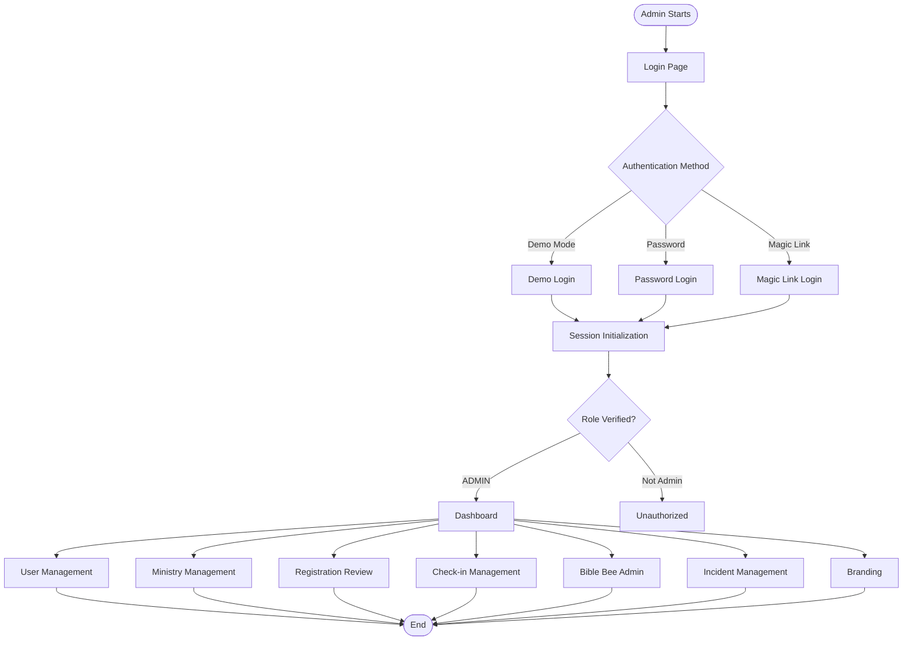

# Admin User Flows

## Role Overview

Admins have full system access and can manage users, ministries, registrations, check-ins, Bible Bee administration, incidents, and branding.

**Permissions:**
- Full access to all features
- User and role management
- Ministry creation and configuration
- Registration review and approval
- System-wide check-in management
- Bible Bee year setup and administration
- Incident review and resolution
- Branding customization

## User Journeys

### 1. Authentication & Session Management
**Flow:** [authentication.md](./authentication.md)

Admin login supports:
- Demo mode (localStorage-based)
- Password authentication (Supabase)
- Magic link authentication (future)
- Session initialization and role assignment

**Key Steps:**
1. Navigate to login page
2. Enter credentials (demo or Supabase)
3. Session initialization
4. Role verification (ADMIN)
5. Redirect to dashboard

### 2. Dashboard Overview
**Flow:** [dashboard.md](./dashboard.md)

Admin dashboard provides:
- System-wide overview
- Quick access to all features
- Navigation to key areas
- Role-based menu filtering

### 3. User Management
**Flow:** [user-management.md](./user-management.md)

Manage users and roles:
- View all users
- Assign/update roles
- Activate/deactivate users
- Manage user permissions

### 4. Ministry Management
**Flow:** [ministry-management.md](./ministry-management.md)

Create and configure ministries:
- Create new ministries
- Edit ministry details
- Assign leaders to ministries
- Configure ministry groups
- Set ministry codes and settings

### 5. Registration Review
**Flow:** [registration-review.md](./registration-review.md)

Review and approve family registrations:
- View pending registrations
- Review household information
- Approve or reject registrations
- Assign household access

### 6. Check-in Management
**Flow:** [check-in-management.md](./check-in-management.md)

System-wide check-in oversight:
- View all check-ins
- Manage events
- Monitor attendance
- Handle check-out verification

### 7. Bible Bee Administration
**Flow:** [bible-bee-admin.md](./bible-bee-admin.md)

Bible Bee year setup and management:
- Create Bible Bee years
- Import scriptures
- Configure divisions
- Track student progress
- Review essay submissions

### 8. Incident Management
**Flow:** [incident-management.md](./incident-management.md)

Review and resolve incidents:
- View reported incidents
- Review incident details
- Assign responses
- Mark incidents as resolved

### 9. Branding Customization
**Flow:** [branding.md](./branding.md)

Customize application branding:
- Upload logos
- Configure app name
- Set color schemes
- Customize UI elements

## High-Level Journey Diagram

## Navigation

- [Main Documentation](../README.md) - Return to main flows documentation
- [Shared Authentication Flows](../shared/authentication-flows.md) - Common auth patterns
- [Shared Registration Flow](../shared/registration-flow.md) - Technical registration details
- [Shared Check-in Technical](../shared/check-in-technical.md) - Technical check-in details
