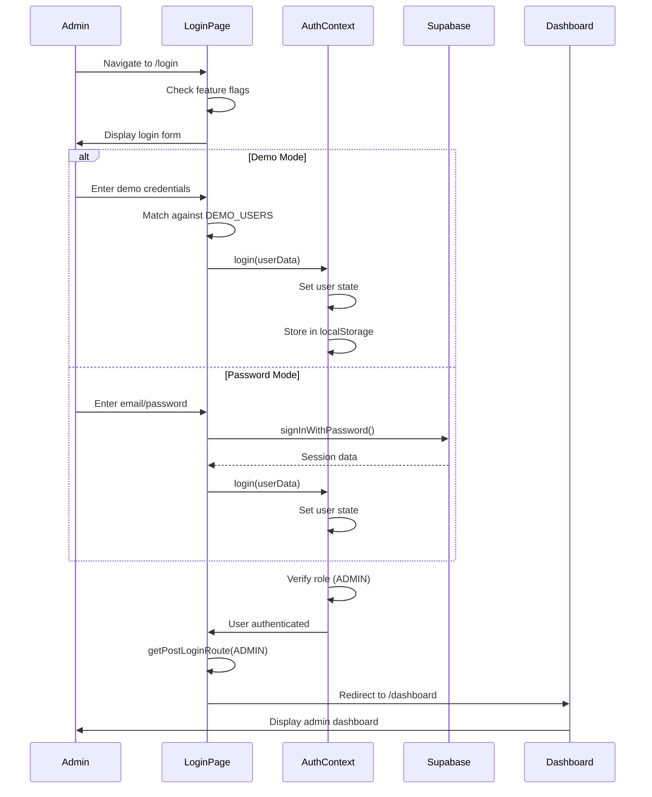

# Admin Authentication Flow

## Overview

Admin authentication supports multiple methods: demo mode (localStorage), password authentication (Supabase), and magic link (future). The flow initializes the session, verifies the ADMIN role, and redirects to the dashboard.

## Flow Steps

1. **Login Page Access**
   - Admin navigates to `/login`
   - Login form displays with email/password fields
   - Demo mode shows demo account options

2. **Authentication Method Selection**
   - Demo mode: Uses localStorage-based authentication
   - Password mode: Uses Supabase password authentication
   - Magic link: Future implementation

3. **Credential Submission**
   - Demo: Matches email/password against demo users
   - Password: Calls `supabase.auth.signInWithPassword()`
   - Validates credentials

4. **Session Initialization**
   - Creates user session in AuthContext
   - Sets user role to ADMIN
   - Stores session (localStorage for demo, Supabase for production)

5. **Role Verification**
   - Verifies user has ADMIN role
   - Checks `user.metadata.role === AuthRole.ADMIN` ⚠️ **Security Risk**: This field is client-writable in Supabase and cannot be used as a trust boundary. A malicious authenticated user could update their own `user_metadata.role` to `ADMIN` via `supabase.auth.updateUser` and then bypass `ProtectedRoute` and any other checks that rely on this value, obtaining full administrative capabilities. ADMIN authorization should instead depend on server-controlled role assignments (for example, Supabase `app_metadata` or an admin-mapping table behind RLS-protected APIs) and the frontend should rely only on an effective role returned from those trusted backends. See [Issue #184](https://github.com/tzlukoma/gather-kids/issues/184) for tracking this security improvement.
   - Redirects unauthorized users

6. **Post-Login Redirect**
   - Uses `getPostLoginRoute(AuthRole.ADMIN)`
   - Redirects to `/dashboard`

## Decision Points

- **Demo vs Production**: Determined by feature flags (`flags.isDemoMode`)
- **Password Enabled**: Checked via `flags.loginPasswordEnabled`
- **Role Assignment**: Set from user metadata or demo user config
- **Session Storage**: localStorage (demo) vs Supabase session (production)

## Medium-Detail Flow Diagram

## Key Components

- **Login Page**: `src/app/login/page.tsx`
- **Auth Context**: `src/contexts/auth-context.tsx`
- **Auth Utils**: `src/lib/auth-utils.ts`
- **Protected Route**: `src/components/auth/protected-route.tsx`

## Error Handling

- **Invalid Credentials**: Shows toast error, stays on login page
- **Email Not Confirmed**: Shows verification message
- **Too Many Requests**: Shows rate limit message
- **Session Error**: Clears localStorage (demo) or signs out (production)

## Related Flows

- [Dashboard](./dashboard.md) - Post-authentication dashboard
- [Shared Authentication Flows](../shared/authentication-flows.md) - Common auth patterns
- [Main Admin README](./README.md) - Return to admin flows overview
