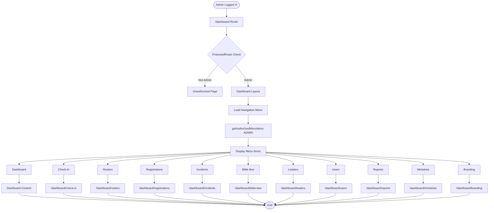

# Admin Dashboard Flow

## Overview

The admin dashboard serves as the central hub for all administrative functions. It provides navigation to key features, system-wide overview, and role-based menu filtering.

## Flow Steps

1. **Dashboard Access**
   - Admin redirected to `/dashboard` after login
   - Protected route verifies ADMIN role
   - Layout component loads with navigation

2. **Navigation Menu Loading**
   - `getAuthorizedMenuItems()` filters menu items by role
   - Only ADMIN-accessible items shown
   - Menu items include: Dashboard, Check-In, Rosters, Registrations, Incidents, Bible Bee, Leaders, Users, Reports, Ministries, Branding

3. **Dashboard Content**
   - Overview cards/widgets
   - Quick access to common tasks
   - Recent activity feed (if implemented)

4. **Navigation Selection**
   - Admin clicks menu item
   - Route protection checks permissions
   - Navigates to selected feature page

## Decision Points

- **Role Verification**: ProtectedRoute checks ADMIN role
- **Menu Filtering**: `getAuthorizedMenuItems()` filters by role
- **Active Status**: Some items require `isActive: true` (check-in, rosters, registrations, Bible Bee)

## Medium-Detail Flow Diagram

## Key Components

- **Dashboard Layout**: `src/app/dashboard/layout.tsx`
- **Navigation**: `src/lib/navigation.tsx`
- **Protected Route**: `src/components/auth/protected-route.tsx`
- **Dashboard Page**: `src/app/dashboard/page.tsx`

## Menu Items Available to Admin

All menu items are available to ADMIN role:
- Dashboard (`/dashboard`)
- Check-In/Out (`/dashboard/check-in`)
- Rosters (`/dashboard/rosters`)
- Registrations (`/dashboard/registrations`)
- Incidents (`/dashboard/incidents`)
- Bible Bee (`/dashboard/bible-bee`)
- Leaders (`/dashboard/leaders`)
- Users (`/dashboard/users`) - Beta
- Reports (`/dashboard/reports`) - Beta
- Ministries (`/dashboard/ministries`)
- Branding (`/dashboard/branding`)

## Related Flows

- [Authentication](./authentication.md) - Login flow
- [User Management](./user-management.md) - User management flow
- [Ministry Management](./ministry-management.md) - Ministry management flow
- [Main Admin README](./README.md) - Return to admin flows overview
