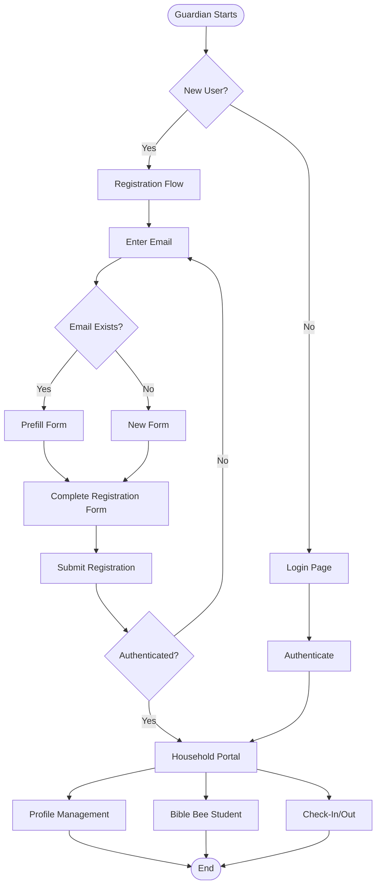

# Guardian User Flows

## Role Overview

Guardians (parents) have access to family registration, household management, Bible Bee student tracking, and check-in/out functionality. They can register their families, manage household profiles, track Bible Bee progress for their children, and check children in/out of events.

**Permissions:**
- Register family/household
- Manage household and child profiles
- Track Bible Bee progress for children
- Check children in/out of events
- View household dashboard

## User Journeys

### 1. Family Registration
**Flow:** [registration.md](./registration.md)

Complete family registration:
- Email entry and verification
- Household information entry
- Guardian information
- Child information and ministry enrollment
- Consent forms
- Bible Bee enrollment (optional)

### 2. Post-Registration Onboarding
**Flow:** [onboarding.md](./onboarding.md)

Complete onboarding after registration:
- Password setup
- Account verification
- Welcome information

### 3. Household Portal
**Flow:** [household-portal.md](./household-portal.md)

Access household dashboard:
- View household information
- View children
- Quick access to features
- Navigation to child-specific pages

### 4. Profile Management
**Flow:** [profile-management.md](./profile-management.md)

Update household and child profiles:
- Edit household information
- Update guardian details
- Modify child information
- Update emergency contacts

### 5. Bible Bee Student Tracking
**Flow:** [bible-bee-student.md](./bible-bee-student.md)

Track Bible Bee progress:
- View assigned scriptures
- Mark scriptures as complete
- Submit essays
- Track progress

### 6. Check-in/Check-out
**Flow:** [check-in-guardian.md](./check-in-guardian.md)

Check children in/out:
- Select event
- Check child in
- Verify PIN for check-out
- View check-in status

## High-Level Journey Diagram

## Key Features

### Registration Flow
- Email lookup to detect existing households
- Prefill for returning families
- Multi-step form with validation
- Draft persistence
- Bible Bee enrollment option

### Household Access
- Access to `/household` route
- View all children in household
- Update household information
- Manage child profiles

### Check-in/Check-out
- Guardian can check children in
- PIN verification for check-out
- View check-in status
- Self-checkout for children 13+

## Navigation

- [Main Documentation](../README.md) - Return to main flows documentation
- [Shared Registration Flow](../shared/registration-flow.md) - Technical registration details
- [Shared Check-in Technical](../shared/check-in-technical.md) - Technical check-in details
