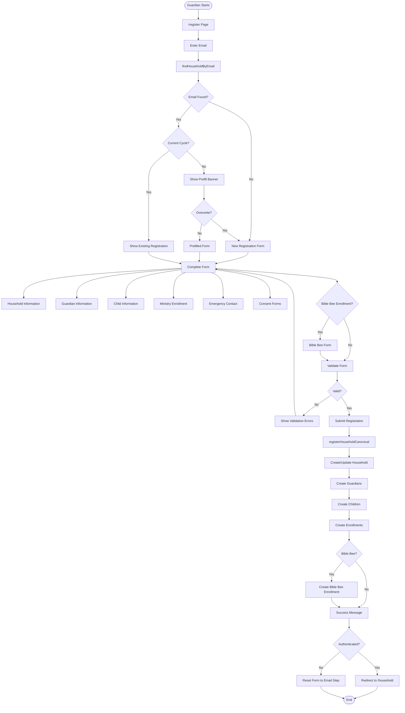

# Guardian Registration Flow

## Overview

The registration flow allows guardians to register their families for ministry programs. It includes email verification, form completion with household/guardian/child information, ministry enrollment, consent forms, and optional Bible Bee enrollment.

## Flow Steps

1. **Email Entry**
   - Guardian navigates to `/register`
   - Enters primary guardian email
   - Submits email for verification

2. **Email Lookup**
   - Calls `findHouseholdByEmail(email, cycleId)`
   - Checks for existing household in current or prior cycles
   - Returns: `{ isCurrentYear, isPrefill, data }`

3. **Form Prefill Decision**
   - **New Email**: Shows empty form
   - **Prior Cycle**: Shows prefill banner, allows overwrite
   - **Current Cycle**: Shows existing registration, allows update

4. **Form Completion**
   - Household information (address, name)
   - Guardian information (primary + additional guardians)
   - Child information (name, DOB, grade, allergies, medical notes)
   - Ministry enrollment (select ministries per child)
   - Emergency contact information
   - Consent forms (liability, photo release, group consents)

5. **Bible Bee Enrollment** (Optional)
   - Select Bible Bee enrollment per child
   - Choose division based on age/grade
   - Confirm enrollment

6. **Form Submission**
   - Validates all required fields
   - Cleans phone numbers
   - Calls `registerHouseholdCanonical(data, cycleId, isPrefill)`
   - Creates/updates household, guardians, children, enrollments

7. **Post-Submission**
   - Shows success message
   - Clears draft data
   - If guardian is authenticated, redirects to `/household`
   - If guardian is not authenticated, returns to the email entry step on `/register` (no automatic `/onboarding` redirect)

## Decision Points

- **Email Exists**: Does email match existing household?
- **Current Cycle**: Is registration for current cycle?
- **Prefill Overwrite**: User choice to overwrite or keep existing data
- **Authenticated User**: Is user logged in?
- **Bible Bee Enrollment**: Optional enrollment per child

## Medium-Detail Flow Diagram

## Key Components

- **Registration Page**: `src/app/register/page.tsx`
- **Registration DAL**: `src/lib/dal.ts` - `findHouseholdByEmail()`, `registerHouseholdCanonical()`
- **Canonical DAL**: `src/lib/database/canonical-dal.ts` - `registerHouseholdCanonical()`
- **Draft Persistence**: `src/hooks/useDraftPersistence.ts`

## Form Sections

1. **Household**
   - Name (optional)
   - Address (line1, line2, city, state, zip)
   - Preferred Scripture Translation

2. **Guardians**
   - Primary guardian (required)
   - Additional guardians (optional)
   - First name, last name, mobile phone, email, relationship

3. **Children**
   - First name, last name, date of birth, grade
   - Mobile phone (optional)
   - Allergies, medical notes
   - Special needs flag and notes
   - Ministry selections
   - Interest selections

4. **Emergency Contact**
   - First name, last name, mobile phone, relationship

5. **Consents**
   - Liability consent (required)
   - Photo release (required)
   - Group consents (dynamic based on ministries)
   - Custom consents (ministry-specific)

## Error Handling

- **Validation Errors**: Shows field-level errors, prevents submission
- **Email Verification**: Required for new registrations
- **Duplicate Check-in**: Prevents checking in child already checked in
- **Database Errors**: Shows error toast, allows retry

## Related Flows

- [Onboarding](./onboarding.md) - Post-registration onboarding
- [Household Portal](./household-portal.md) - Household dashboard
- [Shared Registration Flow](../shared/registration-flow.md) - Technical registration details
- [Main Guardian README](./README.md) - Return to guardian flows overview
