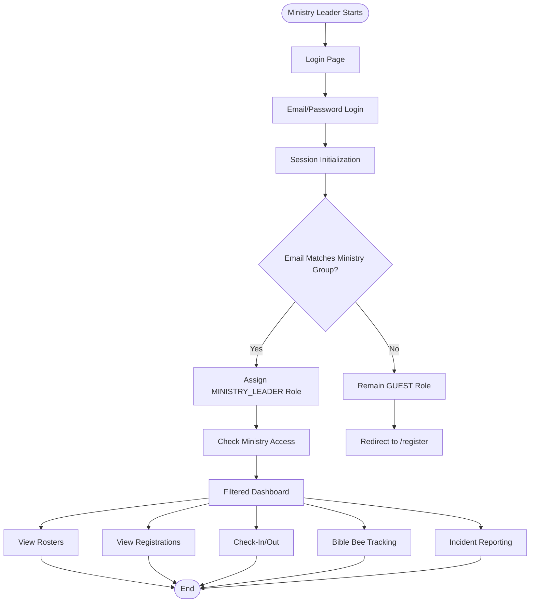

# Ministry Leader User Flows

## Role Overview

Ministry leaders have email-based access to ministry-specific features. Their role is automatically assigned based on email matching ministry group emails, and they have filtered access to rosters, registrations, check-in, Bible Bee tracking, and incident reporting.

**Permissions:**
- Access filtered by assigned ministries
- View ministry-specific rosters
- View filtered registrations
- Check-in children for assigned ministries
- Track Bible Bee progress for assigned students
- Report incidents

## Role Assignment

Ministry leaders are automatically assigned when:
1. User logs in with email matching a ministry group email
2. `listAccessibleMinistriesForEmail()` finds matching ministries
3. Role upgraded from GUEST to MINISTRY_LEADER
4. `assignedMinistryIds` populated with matching ministry IDs

## User Journeys

### 1. Email-Based Authentication
**Flow:** [authentication.md](./authentication.md)

Ministry leader login:
- Email/password authentication
- Automatic role assignment based on email
- Ministry access check
- Filtered dashboard access

### 2. View Rosters
**Flow:** [rosters.md](./rosters.md)

View ministry-specific rosters:
- Filter by assigned ministries
- View children in assigned ministries
- Check-in/check-out children
- Filter by grade, status, event

### 3. View Registrations
**Flow:** [registrations.md](./registrations.md)

View filtered registrations:
- Filter by assigned ministries
- Review household registrations
- View registration details

### 4. Check-in Children
**Flow:** [check-in.md](./check-in.md)

Check children in/out:
- Select event (Sunday School, Children's Church, Teen Church)
- Filter by grade
- Check-in children
- Verify PIN for check-out

### 5. Bible Bee Tracking
**Flow:** [bible-bee-tracking.md](./bible-bee-tracking.md)

Track Bible Bee progress:
- View students in assigned ministries
- Track scripture completion
- Review essay submissions
- Monitor progress

### 6. Incident Reporting
**Flow:** [incident-reporting.md](./incident-reporting.md)

Report incidents:
- Create incident reports
- Submit incident details
- Track incident status

## High-Level Journey Diagram

## Key Features

### Ministry Filtering
All views are filtered by `assignedMinistryIds`:
- Only shows data for assigned ministries
- Menu items filtered by `ministryCheck` function
- Bible Bee access requires ministry code 'bible-bee'

### Role Auto-Assignment
- Email matching triggers automatic role upgrade
- Happens during login and session initialization
- Prevents blocking by checking synchronously when needed

## Navigation

- [Main Documentation](../README.md) - Return to main flows documentation
- [Shared Authentication Flows](../shared/authentication-flows.md) - Common auth patterns
- [Shared Check-in Technical](../shared/check-in-technical.md) - Technical check-in details
