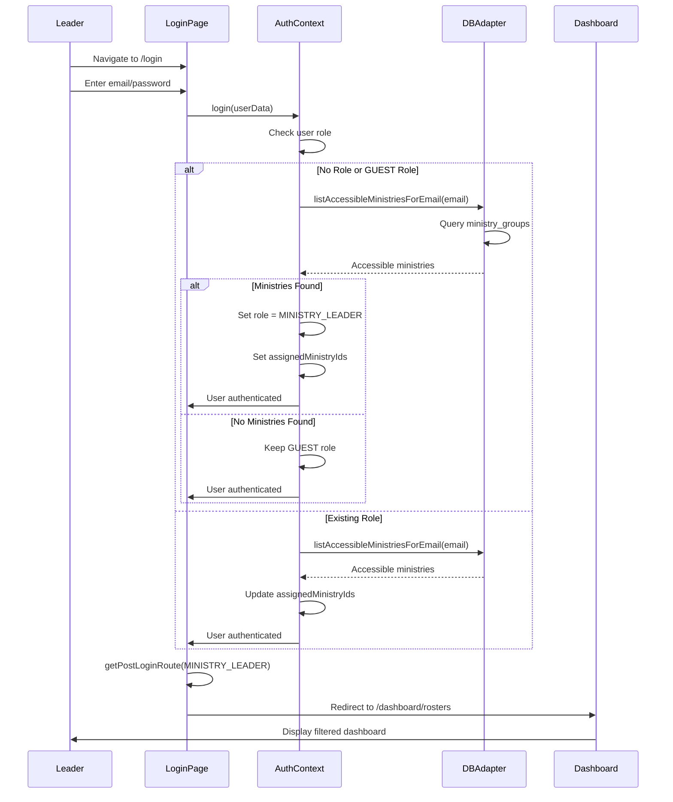

# Ministry Leader Authentication Flow

## Overview

Ministry leaders authenticate via email/password. Their role is automatically assigned based on email matching ministry group emails. The system checks ministry access and assigns the MINISTRY_LEADER role if matching ministries are found.

## Flow Steps

1. **Login Page Access**
   - Ministry leader navigates to `/login`
   - Enters email and password
   - Submits credentials

2. **Authentication**
   - Calls `supabase.auth.signInWithPassword()` (production)
   - Or matches against demo users (demo mode)
   - Validates credentials

3. **Session Initialization**
   - AuthContext receives user data
   - Checks if user has existing role
   - If no role or GUEST role, checks ministry access

4. **Ministry Access Check**
   - Calls `dbAdapter.listAccessibleMinistriesForEmail(email)`
   - Queries ministry_groups table for matching email
   - Returns list of accessible ministries

5. **Role Assignment**
   - If ministries found and no role/GUEST role:
     - Assigns MINISTRY_LEADER role
     - Sets `assignedMinistryIds` array
   - If ministries found but role exists:
     - Updates `assignedMinistryIds` only
   - If no ministries found:
     - Clears `assignedMinistryIds`
     - Keeps existing role or remains GUEST

6. **Post-Login Redirect**
   - Uses `getPostLoginRoute(AuthRole.MINISTRY_LEADER)`
   - Redirects to `/dashboard/rosters`

## Decision Points

- **Email Match**: Does email match any ministry group email?
- **Existing Role**: Does user already have a role assigned?
- **Ministry Access**: Are there accessible ministries for this email?
- **Role Priority**: When a user has both GUARDIAN and MINISTRY_LEADER capabilities, MINISTRY_LEADER is treated as the primary role for redirects (per `ROLE_PRIORITY` / `getUserRole()` in `src/lib/auth-utils.ts`)

## Medium-Detail Flow Diagram

## Key Components

- **Login Page**: `src/app/login/page.tsx`
- **Auth Context**: `src/contexts/auth-context.tsx` - `checkAndUpdateMinistryAccess()`
- **Database Adapter**: `src/lib/database/factory.ts` - `listAccessibleMinistriesForEmail()`
- **Auth Utils**: `src/lib/auth-utils.ts` - `getPostLoginRoute()`

## Ministry Access Logic

The system checks ministry access by:
1. Querying `ministry_groups` table for matching email
2. Finding all ministries associated with matching groups
3. Returning ministry IDs for filtering

## Error Handling

- **Invalid Credentials**: Shows toast error, stays on login page
- **No Ministry Access**: User remains GUEST, redirected to `/register`
- **Database Error**: Logs error, doesn't block authentication
- **Session Error**: Clears session, redirects to login

## Related Flows

- [Rosters](./rosters.md) - Post-authentication rosters view
- [Shared Authentication Flows](../shared/authentication-flows.md) - Common auth patterns
- [Main Ministry Leader README](./README.md) - Return to ministry leader flows overview
