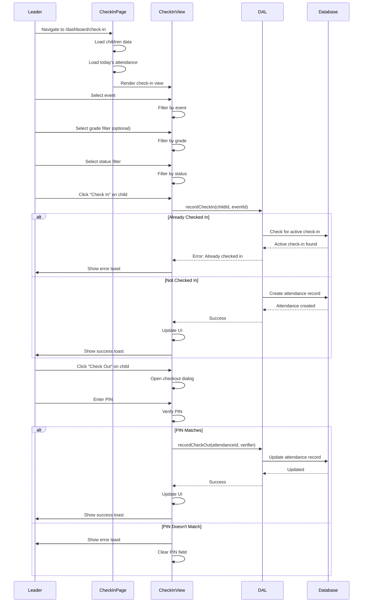

# Check-in/Check-out Flow (Ministry Leader & Guardian)

## Overview

The check-in/check-out flow allows ministry leaders and guardians to check children in and out of events. It includes event selection, child selection, check-in recording, PIN verification for check-out, and status filtering.

## Flow Steps

1. **Access Check-in Page**
   - Navigate to `/dashboard/check-in` (leaders) or check-in from household portal (guardians)
   - Protected route verifies role (MINISTRY_LEADER, GUARDIAN, or ADMIN)
   - Loads children data and today's attendance

2. **Event Selection**
   - Select event: Sunday School, Children's Church, or Teen Church
   - Event selection filters available children
   - Updates UI to show event-specific check-ins

3. **Filter Children**
   - Filter by grade (optional)
   - Filter by status: All, Checked In, Checked Out
   - Apply filters to child list

4. **Check-in Child**
   - Select child from list
   - Click "Check In" button
   - Calls `recordCheckIn(childId, eventId, timeslotId, userId)`
   - Creates attendance record with `check_in_at` timestamp
   - Updates UI to show checked-in status

5. **Check-out Child**
   - Select checked-in child
   - Click "Check Out" button
   - Opens checkout dialog
   - Enter PIN (last 4 digits of phone number)
   - Verify PIN against guardian/emergency contact/child phone
   - Calls `recordCheckOut(attendanceId, verifier, userId)`
   - Updates attendance record with `check_out_at` timestamp

6. **PIN Verification**
   - Check last 4 digits against:
     - Primary guardian mobile phone
     - Additional guardians mobile phone
     - Emergency contact mobile phone
     - Child mobile phone (if age 13+)
   - Match found: Proceed with checkout
   - No match: Show error, allow retry

## Decision Points

- **Event Selection**: Which event is being managed?
- **Child Status**: Is child already checked in?
- **PIN Match**: Does entered PIN match any authorized phone?
- **Self-Checkout**: Is child 13+ and can self-checkout?
- **Active Check-in**: Is child already checked in to another event?

## Medium-Detail Flow Diagram

## Key Components

- **Check-in Page**: `src/app/dashboard/check-in/page.tsx`
- **Check-in View**: `src/components/gatherKids/check-in-view.tsx`
- **Checkout Dialog**: `src/components/gatherKids/checkout-dialog.tsx`
- **DAL Functions**: `src/lib/dal.ts` - `recordCheckIn()`, `recordCheckOut()`
- **Attendance Hooks**: `src/hooks/data/attendance.ts`

## PIN Verification Logic

The checkout dialog verifies PIN by checking last 4 digits against:
1. Primary guardian mobile phone
2. Additional guardians mobile phone
3. Emergency contact mobile phone
4. Child mobile phone (if child is 13+)

If match found, checkout proceeds with matched person name recorded.

## Error Handling

- **Already Checked In**: Shows error if child already checked in to another event
- **Invalid PIN**: Shows error toast, clears PIN field, allows retry
- **Database Error**: Shows error toast, allows retry
- **No Active Check-in**: Prevents checkout if no active check-in found

## Related Flows

- [Shared Check-in Technical](../shared/check-in-technical.md) - Technical check-in details
- [Main Ministry Leader README](./README.md) - Return to ministry leader flows overview
- [Guardian Check-in](./guardian/check-in-guardian.md) - Guardian-specific check-in flow
