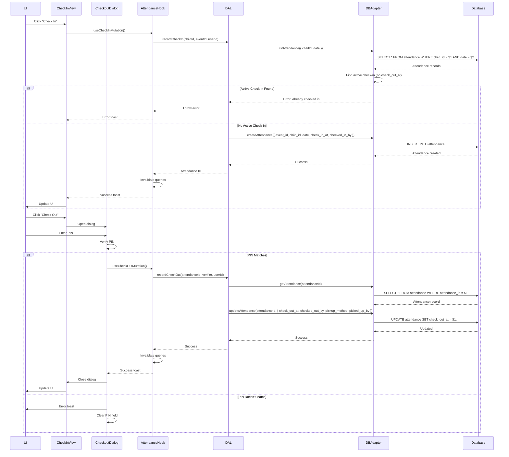

# Shared Check-in Technical Flow

## Overview

This document provides detailed technical implementation of the check-in/check-out flow, including API calls, database operations, PIN verification logic, and error handling.

## Technical Flow

### 1. Check-in Process

**Function**: `recordCheckIn(childId, eventId, timeslotId, userId)`

**Process:**

#### Step 1: Check for Active Check-in
```typescript
const activeCheckIns = await dbAdapter.listAttendance({
  childId: childId,
  date: today
});

const activeCheckIn = activeCheckIns.find(rec => !rec.check_out_at);
if (activeCheckIn) {
  throw new Error("This child is already checked in to another event.");
}
```

#### Step 2: Create Attendance Record
```typescript
const attendanceRecord = await dbAdapter.createAttendance({
  event_id: eventId,
  child_id: childId,
  date: today,
  timeslot_id: timeslotId,
  check_in_at: new Date().toISOString(),
  checked_in_by: userId,
});
```

**Database Operation:**
```sql
INSERT INTO attendance (
  attendance_id,
  event_id,
  child_id,
  date,
  timeslot_id,
  check_in_at,
  checked_in_by
) VALUES ($1, $2, $3, $4, $5, $6, $7)
```

### 2. Check-out Process

**Function**: `recordCheckOut(attendanceId, verifier, userId)`

**Process:**

#### Step 1: Get Attendance Record
```typescript
const attendanceRecord = await dbAdapter.getAttendance(attendanceId);
if (!attendanceRecord) {
  throw new Error("Attendance record not found");
}
```

#### Step 2: Update Attendance Record
```typescript
const updatedRecord = await dbAdapter.updateAttendance(attendanceId, {
  check_out_at: new Date().toISOString(),
  checked_out_by: userId,
  pickup_method: verifier.method, // 'PIN' or 'other'
  picked_up_by: verifier.pickedUpBy || (verifier.method === 'other' ? verifier.value : undefined),
});
```

**Database Operation:**
```sql
UPDATE attendance
SET 
  check_out_at = $1,
  checked_out_by = $2,
  pickup_method = $3,
  picked_up_by = $4
WHERE attendance_id = $5
```

### 3. PIN Verification Logic

**Component**: `CheckoutDialog`

**Process:**

```typescript
// Check guardians
for (const guardian of child.guardians) {
  if (guardian.mobile_phone.slice(-4) === pin) {
    matchedPerson = `${guardian.first_name} ${guardian.last_name}`;
    break;
  }
}

// Check emergency contact
if (!matchedPerson && child.emergencyContact?.mobile_phone?.slice(-4) === pin) {
  matchedPerson = `${child.emergencyContact.first_name} ${child.emergencyContact.last_name}`;
}

// Check child's own phone (if 13+)
if (!matchedPerson && canSelfCheckout && child.child_mobile?.slice(-4) === pin) {
  matchedPerson = `${child.first_name} ${child.last_name} (Self)`;
}
```

**Self-Checkout Eligibility:**
```typescript
const canSelfCheckout = child.age >= 13;
```

## Detailed Technical Sequence Diagram



## Query Invalidation

After check-in/check-out mutations, React Query invalidates related queries:

```typescript
// After check-in
queryClient.invalidateQueries({ queryKey: queryKeys.attendance(today) });
queryClient.invalidateQueries({ queryKey: queryKeys.attendance(today, eventId) });
queryClient.invalidateQueries({ queryKey: queryKeys.checkedInChildren(today) });
queryClient.invalidateQueries({ queryKey: queryKeys.checkedInCount(today) });
queryClient.invalidateQueries({ queryKey: queryKeys.children() });

// After check-out
queryClient.invalidateQueries({ queryKey: queryKeys.attendance(today) });
queryClient.invalidateQueries({ queryKey: queryKeys.attendance(today, eventId) });
```

## Data Structures

### Attendance Record
```typescript
interface Attendance {
  attendance_id: string;
  event_id: string;
  child_id: string;
  date: string; // ISO date
  timeslot_id?: string;
  check_in_at: string; // ISO timestamp
  check_out_at?: string; // ISO timestamp
  checked_in_by?: string; // User ID
  checked_out_by?: string; // User ID
  pickup_method?: 'PIN' | 'other';
  picked_up_by?: string; // Person name
}
```

### Verifier Object
```typescript
interface Verifier {
  method: 'PIN' | 'other';
  value: string; // PIN or other identifier
  pickedUpBy?: string; // Person name (for PIN method)
}
```

## Error Handling

### Check-in Errors
- **Already Checked In**: Child already checked in to another event
- **Database Error**: Transaction failed, show error toast
- **Invalid Child ID**: Child not found, show error toast

### Check-out Errors
- **No Active Check-in**: Child not checked in, prevent checkout
- **Invalid PIN**: PIN doesn't match any authorized phone
- **Attendance Not Found**: Attendance record missing
- **Database Error**: Update failed, show error toast

## Related Flows

- [Ministry Leader Check-in](../ministry-leader/check-in.md) - Ministry leader check-in flow
- [Guardian Check-in](../guardian/check-in-guardian.md) - Guardian check-in flow
- [Main Documentation](../README.md) - Return to main flows documentation
