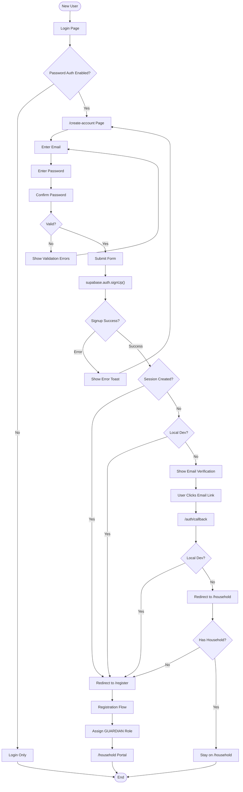
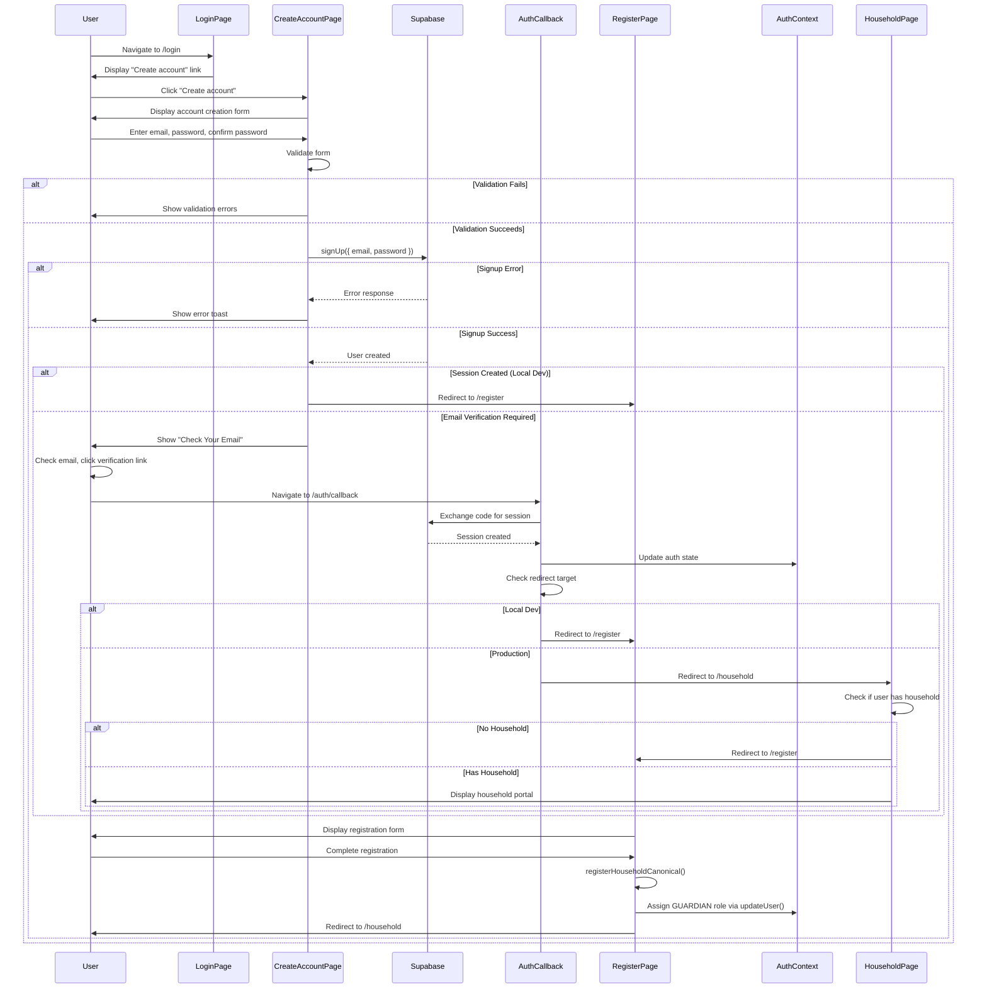

# New User Account Creation Flow

## Overview

New users who don't have a role yet need to create an account before they can register their family. This flow covers the account creation process that leads to the registration flow.

## Flow Steps

1. **Access Login Page**
   - User navigates to `/login`
   - Sees "Create account" link (when password auth is enabled)
   - Clicks link to navigate to `/create-account`

2. **Create Account Page**
   - User enters email and password
   - Confirms password
   - Validates password requirements (minimum 6 characters)
   - Submits form

3. **Account Creation**
   - Calls `supabase.auth.signUp({ email, password })`
   - Creates user in Supabase Auth
   - Sets `emailRedirectTo: /auth/callback` for email verification

4. **Post-Creation Redirect**
   - **If session created** (local dev or auto-confirm):
     - Redirects to `/register`
     - User can immediately start registration
   - **If email verification required**:
     - Shows "Check Your Email" message
     - User must verify email via link
     - After verification, redirects to `/auth/callback`
     - Callback redirects to `/household` (non-local-dev) or `/register` (local-dev)
     - If user has no household, `/household` redirects to `/register`

5. **Registration Flow**
   - User completes family registration
   - Gets GUARDIAN role assigned during registration
   - Redirects to `/household` (where any onboarding experience is surfaced, for example via an onboarding modal)

## Decision Points

- **Password Auth Enabled**: Is password authentication enabled? (Feature flag)
- **Demo Mode**: In demo mode, redirects to login (no account creation)
- **Email Verification**: Does Supabase require email verification?
- **Session Created**: Was session created immediately? (local dev vs production)

## Medium-Detail Flow Diagram



## Key Components

- **Create Account Page**: `src/app/create-account/page.tsx`
- **Auth Callback**: `src/app/auth/callback/page.tsx`
- **Registration Page**: `src/app/register/page.tsx`
- **Auth Utils**: `src/lib/auth-utils.ts` - `getPostLoginRoute(null)` → `/register`

## Account Creation Logic

### Password Validation
- Minimum 6 characters
- Password and confirm password must match
- All fields required

### Supabase Signup
```typescript
supabase.auth.signUp({
  email,
  password,
  options: {
    emailRedirectTo: `${baseUrl}/auth/callback`,
  },
})
```

### Post-Signup Behavior

**Local Development:**
- Email confirmations often disabled
- Session created immediately
- Redirects to `/register` right away

**Production:**
- Email verification required
- Shows "Check Your Email" message
- User clicks verification link
- Redirects to `/auth/callback`
- Callback redirects to `/household` (non-local-dev) or `/register` (local-dev)
- If user has no household, `/household` redirects to `/register`

## Error Handling

- **Password Mismatch**: Shows error, prevents submission
- **Password Too Short**: Shows error, prevents submission
- **Missing Fields**: Shows error, prevents submission
- **Signup Error**: Shows error toast with message
- **Timeout**: Shows timeout error (15 second limit)

## Role Assignment

After account creation:
- User has **no role** initially (`role: null` or `GUEST`)
- After completing registration, gets **GUARDIAN** role assigned during registration via `supabase.auth.updateUser()`
- Role assignment happens synchronously during `registerHouseholdCanonical()` process

## Sequence Diagram



## Related Flows

- [Guardian Registration](../guardian/registration.md) - Registration flow after account creation
- [Shared Authentication Flows](./authentication-flows.md) - Common auth patterns
- [Main Documentation](../README.md) - Return to main flows documentation

## Notes

- Account creation is only available when `loginPasswordEnabled` feature flag is true
- In demo mode, account creation is disabled (redirects to login)
- New users without roles are redirected to `/register` by `getPostLoginRoute(null)`
- The registration flow supports both authenticated sessions and magic-link-based flows; it always looks up households by email (via `findHouseholdByEmail(user.email, cycleId)`)
- For unauthenticated/magic-link flows, whether email verification is required for new registrations is controlled by the `loginMagicEnabled` feature flag
- Registration does not create new auth users — users must already have an auth account/session created via `/create-account` (password auth) or via the magic-link flow
