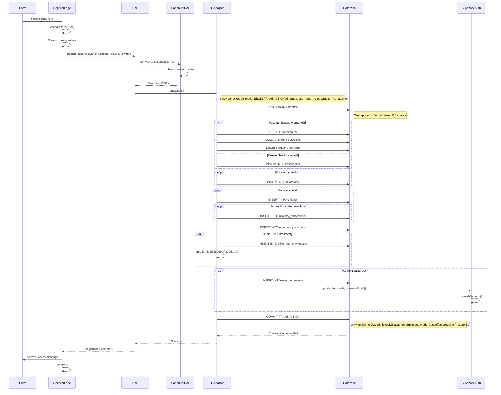

# Shared Registration Flow (Technical)

## Overview

This document provides detailed technical implementation of the registration flow, including API calls, database operations, data transformations, and error handling.

## Technical Flow

### 1. Email Lookup

**Function**: `findHouseholdByEmail(email, cycleId)`

**Process:**
1. Look up guardian by email in `guardians` table
2. Infer associated household from guardian record
3. Get all children for the household
4. Check `ministry_enrollments` for those children in the current cycle
5. Check `ministry_enrollments` for those children in the prior cycle (currentCycleId - 1)
6. Return result: `{ isCurrentYear, isPrefill, data }`

**Database Operations:**
```sql
-- Find household by guardian email
SELECT h.*
FROM households h
JOIN guardians g ON g.household_id = h.id
WHERE g.email = $1;

-- Get children for the household
SELECT child_id
FROM children
WHERE household_id = $1;

-- Check ministry enrollments for current cycle (by child_id, not household_id)
SELECT *
FROM ministry_enrollments
WHERE child_id = ANY($2) AND cycle_id = $3;

-- Check ministry enrollments for prior cycle (currentCycleId - 1)
SELECT *
FROM ministry_enrollments
WHERE child_id = ANY($2) AND cycle_id = $4;
```

### 2. Form Data Collection

**Components:**
- Household information
- Guardian array (primary + additional)
- Child array (with ministry selections)
- Emergency contact
- Consents (liability, photo release, group consents)

**Validation:**
- Zod schema validation
- Field-level validation
- Cross-field validation (e.g., custom consents based on ministry selections)

### 3. Registration Submission

**Function**: `registerHouseholdCanonical(data, cycleId, isPrefill)`

**Process:**

#### Step 1: Convert to Canonical Format
- Transform form data to canonical DTOs
- Standardize data shapes
- Validate canonical format

#### Step 2: Database Transaction
```typescript
// IndexedDB/Dexie: operations run in a single real DB transaction.
// Supabase: this is a best-effort logical grouping and is NOT atomic.
await dbAdapter.transaction(async () => {
  // All operations grouped together
})
```

#### Step 3: Household Creation/Update
```typescript
if (isUpdate) {
  await dbAdapter.updateHousehold(householdId, household);
} else {
  await dbAdapter.createHousehold(household);
}
```

#### Step 4: Guardian Creation
```typescript
for (const guardianData of guardians) {
  const guardian = await dbAdapter.createGuardian({
    household_id: householdId,
    ...guardianData
  });
  createdGuardians.push(guardian);
}
```

#### Step 5: Child Creation
```typescript
for (const childData of children) {
  const child = await dbAdapter.createChild({
    household_id: householdId,
    ...childData
  });
  
  // Auto-enroll in Sunday School (always happens)
  await dbAdapter.createMinistryEnrollment({
    child_id: child.child_id,
    ministry_id: "min_sunday_school",
    cycle_id: cycleId,
    status: 'enrolled'
  });
  
  // Handle ministry and interest selections (keyed by ministry code)
  const ministrySelections = childData.ministrySelections || {}; // e.g., { "min_basketball": true }
  const interestSelections = childData.interestSelections || {}; // e.g., { "min_choir": true }
  const allSelections = { ...ministrySelections, ...interestSelections };
  
  // Map ministry codes to ministry_id via listMinistries()
  const allMinistries = await dbAdapter.listMinistries();
  const ministryMap = new Map(allMinistries.map(m => [m.code, m]));
  
  // Create enrollments for selected ministries (excluding Sunday School, already enrolled)
  for (const ministryCode in allSelections) {
    if (allSelections[ministryCode] && ministryCode !== 'min_sunday_school') {
      const ministry = ministryMap.get(ministryCode);
      if (ministry) {
        await dbAdapter.createMinistryEnrollment({
          child_id: child.child_id,
          ministry_id: ministry.ministry_id, // Use ministry_id from mapped ministry
          cycle_id: cycleId,
          status: 'enrolled'
        });
      }
    }
  }
}
```

#### Step 6: Emergency Contact Creation
```typescript
await dbAdapter.createEmergencyContact({
  household_id: householdId,
  ...emergencyContactData
});
```

#### Step 7: Bible Bee Enrollment (Optional)
```typescript
if (bibleBeeEnrollment) {
  const { enrollmentId, bibleBeeCycleId, divisionId } = bibleBeeEnrollment;

  // Create Bible Bee enrollment record in bible_bee_enrollments table
  await dbAdapter.createEnrollment({
    id: enrollmentId,
    child_id: child.child_id,
    bible_bee_cycle_id: bibleBeeCycleId,
    division_id: divisionId
  });
  
  // Optionally assign scriptures via enrollChildInBibleBee helper
  await enrollChildInBibleBee(child.child_id, bibleBeeCycleId);
}
```

#### Step 8: Link Auth User to Household
```typescript
// Assumes the caller is already authenticated (via /create-account or magic-link)
const session = await supabase.auth.getSession();

if (session?.data?.session?.user) {
  // Note: Currently uses direct Supabase insert because DatabaseAdapter 
  // doesn't have a createUserHousehold method. This is a known inconsistency
  // with the adapter pattern and should ideally be added to the adapter interface.
  await supabase
    .from('user_households')
    .insert({
      auth_user_id: session.data.session.user.id,
      household_id: householdId
    });

  // Update user metadata with role and household_id
  await supabase.auth.updateUser({
    data: {
      role: AuthRole.GUARDIAN,
      household_id: householdId
    }
  });
  
  // Refresh session to ensure AuthContext picks up role change
  await supabase.auth.refreshSession();
}
```

## Detailed Technical Sequence Diagram



## Data Transformations

### Form Data → Canonical DTOs

**Household:**
```typescript
{
  household_id: string | undefined,
  name: string | undefined,
  address_line1: string,
  address_line2: string | undefined,
  city: string,
  state: string,
  zip: string,
  preferred_scripture_translation: string | undefined,
  primary_email: string
}
```

**Guardian:**
```typescript
{
  first_name: string,
  last_name: string,
  mobile_phone: string, // cleaned
  email: string | undefined,
  relationship: string,
  is_primary: boolean
}
```

**Child:**
```typescript
{
  first_name: string,
  last_name: string,
  dob: string, // ISO date
  grade: string,
  child_mobile: string | undefined, // cleaned
  allergies: string | undefined,
  medical_notes: string | undefined,
  special_needs: boolean | undefined,
  special_needs_notes: string | undefined
}
```

## Error Handling

### Validation Errors
- Field-level validation errors shown inline
- Form submission blocked until valid
- Error messages from Zod schema

### Database Errors
- **Dexie/offline mode**: Registration writes are wrapped in an IndexedDB transaction; if any step fails, the entire transaction is rolled back
- **Supabase/live mode**: Operations are executed as a best-effort grouped sequence; on error, further steps are aborted but earlier successful writes are not automatically rolled back at the database level
- Error toast shown to user
- Form data preserved (draft persistence)
- User can retry submission (the flow treats the operation as failed and re-attempts the full sequence, while any partial data from a prior attempt is handled by the backend reconciliation logic)

### User Creation Errors
- Account creation happens separately via `/create-account` or magic-link auth
- Registration can be submitted by unauthenticated users, but this creates an "orphaned" registration
- **Orphaned Registration Issue:** If the user is not authenticated, registration data is saved to the database (household, guardians, children, enrollments), but no `user_households` record is created and no role is assigned. The user is returned to the email entry step; re-entering the same email will still find and prefill the saved registration via `findHouseholdByEmail`, but they will not have an authenticated account linked to that household and therefore cannot access the `/household` portal. See [issue #185](https://github.com/tzlukoma/gather-kids/issues/185) for tracking the implementation of requiring authentication before registration submission.
- For an already authenticated user, the `GUARDIAN` role and `household_id` are assigned during registration via `supabase.auth.updateUser({ data: { role: 'GUARDIAN', household_id } })` and the session is refreshed

## Draft Persistence

Drafts are managed via the shared `useDraftPersistence` hook, which persists data through the app's database adapter (`dbAdapter.getDraft` / `dbAdapter.saveDraft`). In the current registration page implementation (`src/app/register/page.tsx`), this hook is initialized with `enabled: false`, so draft persistence is effectively feature-flagged/temporarily disabled there; the behavior below describes how it works when enabled:

- Saves via debounced `saveDraft` calls triggered by form state changes (for example, after field blur or section completion, depending on the specific integration)
- Loads on page load only when draft persistence is enabled for the given flow
- Cleared on successful submission (and/or when the user explicitly discards the draft, if that UI is provided)
- When enabled, drafts are keyed by `formName` (currently `registration_v1`) together with the household/email identifier, rather than a raw localStorage key

## Related Flows

- [Guardian Registration](../guardian/registration.md) - User-facing registration flow
- [Main Documentation](../README.md) - Return to main flows documentation
