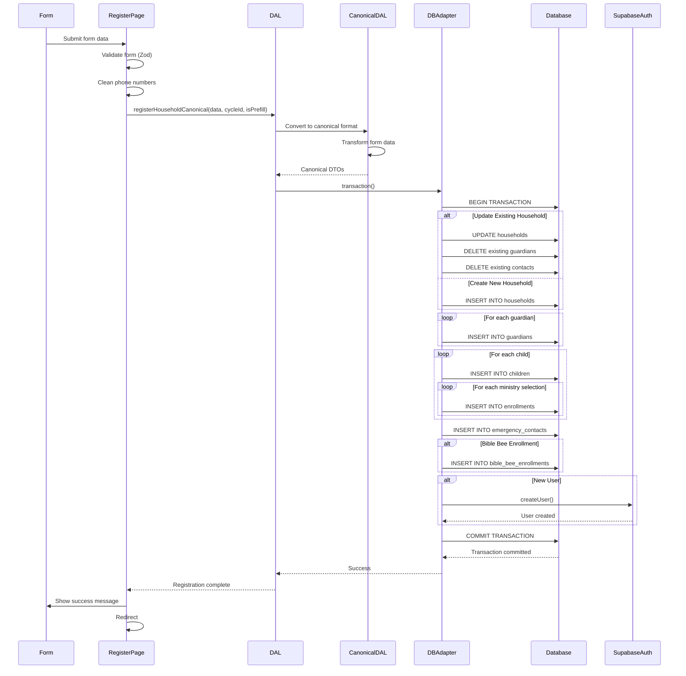

# Shared Registration Flow (Technical)

## Overview

This document provides detailed technical implementation of the registration flow, including API calls, database operations, data transformations, and error handling.

## Technical Flow

### 1. Email Lookup

**Function**: `findHouseholdByEmail(email, cycleId)`

**Process:**
1. Query `households` table for matching email
2. Check if household exists in current cycle
3. Check if household exists in prior cycles
4. Return result: `{ isCurrentYear, isPrefill, data }`

**Database Operations:**
```sql
-- Find household by email
SELECT * FROM households WHERE email = $1

-- Check enrollments for cycle
SELECT * FROM enrollments 
WHERE household_id = $1 AND cycle_id = $2
```

### 2. Form Data Collection

**Components:**
- Household information
- Guardian array (primary + additional)
- Child array (with ministry selections)
- Emergency contact
- Consents (liability, photo release, group consents)

**Validation:**
- Zod schema validation
- Field-level validation
- Cross-field validation (e.g., custom consents based on ministry selections)

### 3. Registration Submission

**Function**: `registerHouseholdCanonical(data, cycleId, isPrefill)`

**Process:**

#### Step 1: Convert to Canonical Format
- Transform form data to canonical DTOs
- Standardize data shapes
- Validate canonical format

#### Step 2: Database Transaction
```typescript
await dbAdapter.transaction(async () => {
  // All operations in single transaction
})
```

#### Step 3: Household Creation/Update
```typescript
if (isUpdate) {
  await dbAdapter.updateHousehold(householdId, household);
} else {
  await dbAdapter.createHousehold(household);
}
```

#### Step 4: Guardian Creation
```typescript
for (const guardianData of guardians) {
  const guardian = await dbAdapter.createGuardian({
    household_id: householdId,
    ...guardianData
  });
  createdGuardians.push(guardian);
}
```

#### Step 5: Child Creation
```typescript
for (const childData of children) {
  const child = await dbAdapter.createChild({
    household_id: householdId,
    ...childData
  });
  
  // Create enrollments
  for (const ministryId of child.ministrySelections) {
    await dbAdapter.createEnrollment({
      child_id: child.child_id,
      ministry_id: ministryId,
      cycle_id: cycleId
    });
  }
}
```

#### Step 6: Emergency Contact Creation
```typescript
await dbAdapter.createEmergencyContact({
  household_id: householdId,
  ...emergencyContactData
});
```

#### Step 7: Bible Bee Enrollment (Optional)
```typescript
if (bibleBeeEnrollment) {
  await dbAdapter.createBibleBeeEnrollment({
    child_id: child.child_id,
    year: bibleBeeYear,
    division: division
  });
}
```

#### Step 8: User Creation (if new email)
```typescript
if (!existingUser) {
  await supabase.auth.admin.createUser({
    email: primaryEmail,
    user_metadata: {
      role: AuthRole.GUARDIAN,
      household_id: householdId
    }
  });
}
```

## Detailed Technical Sequence Diagram



## Data Transformations

### Form Data → Canonical DTOs

**Household:**
```typescript
{
  household_id: string | undefined,
  name: string | undefined,
  address_line1: string,
  address_line2: string | undefined,
  city: string,
  state: string,
  zip: string,
  preferred_scripture_translation: string | undefined,
  primary_email: string
}
```

**Guardian:**
```typescript
{
  first_name: string,
  last_name: string,
  mobile_phone: string, // cleaned
  email: string | undefined,
  relationship: string,
  is_primary: boolean
}
```

**Child:**
```typescript
{
  first_name: string,
  last_name: string,
  dob: string, // ISO date
  grade: string,
  child_mobile: string | undefined, // cleaned
  allergies: string | undefined,
  medical_notes: string | undefined,
  special_needs: boolean | undefined,
  special_needs_notes: string | undefined
}
```

## Error Handling

### Validation Errors
- Field-level validation errors shown inline
- Form submission blocked until valid
- Error messages from Zod schema

### Database Errors
- Transaction rollback on error
- Error toast shown to user
- Form data preserved (draft persistence)
- User can retry submission

### User Creation Errors
- If user creation fails, household still created
- User can log in later with magic link
- Role assignment happens on first login

## Draft Persistence

Form data is saved to localStorage as user types:
- Saves on field blur
- Loads on page load
- Cleared on successful submission
- Key: `registration-draft-{email}`

## Related Flows

- [Guardian Registration](../guardian/registration.md) - User-facing registration flow
- [Main Documentation](../README.md) - Return to main flows documentation
